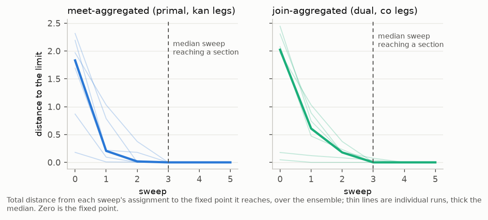
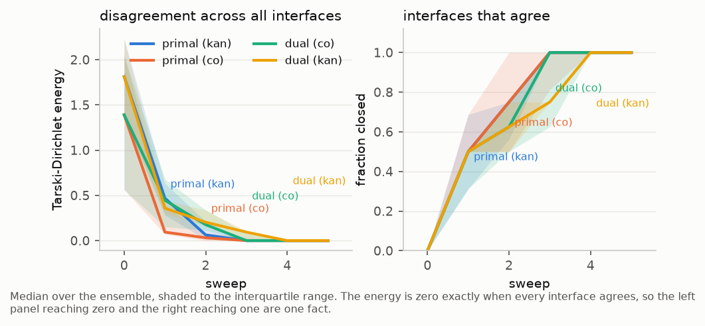
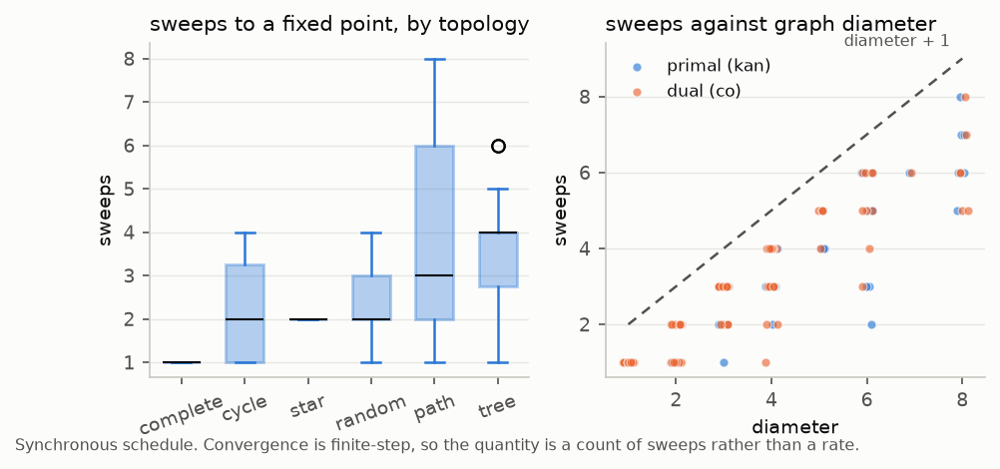
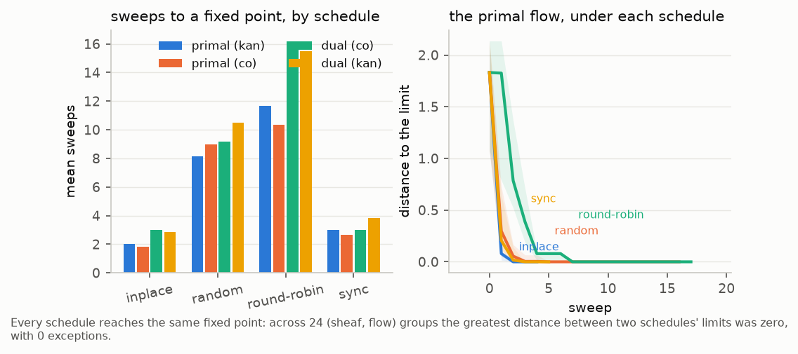
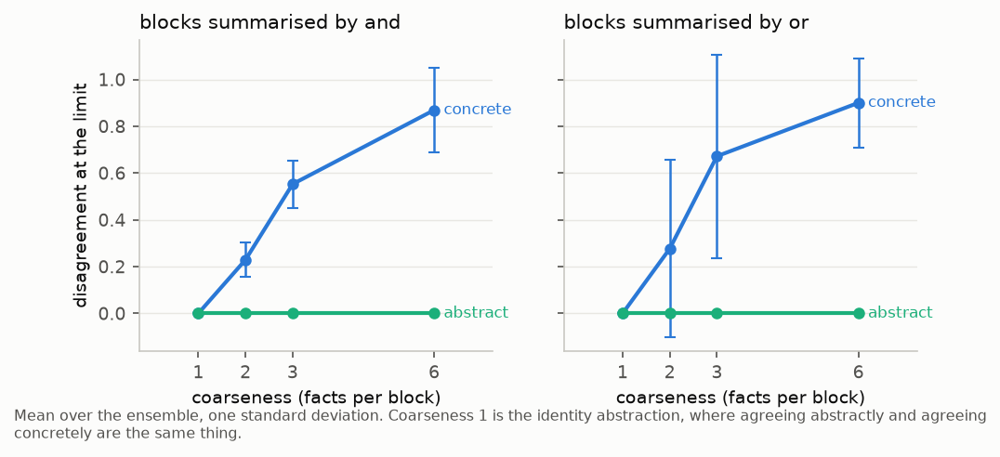
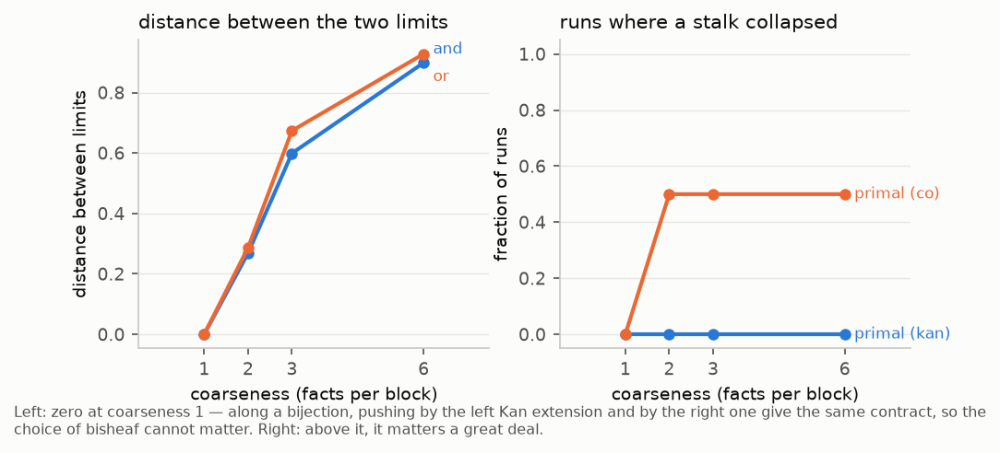
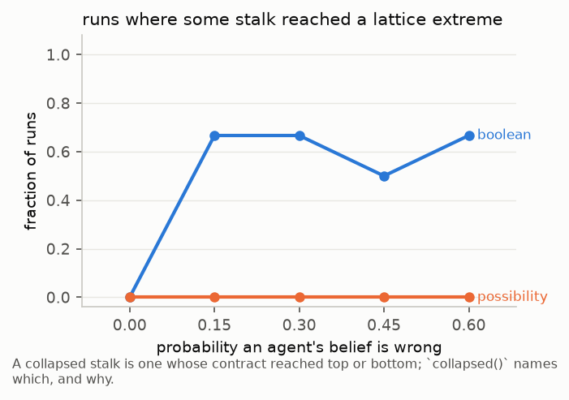
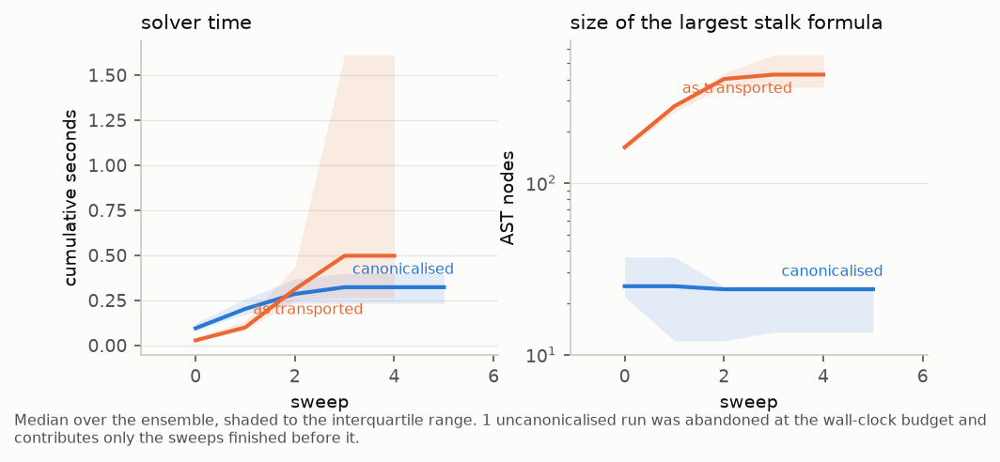

# Convergence, measured

The test suite proves the theorems and `exp/validate_theory.py` samples initial
assignments, and between them they answer every question about the flow with a
boolean. A reviewer asking *does it converge, how fast, and to what* gets a table
of passes. This document is the quantitative answer: a distance between
contracts, the sheaf-level quantities it induces, a randomized ensemble of
contract sheaves to run them on, and eight figures.

Everything here is produced by `exp/convergence.py` and drawn by
`exp/figures.py`; the library side is `measure.py`, `diagnostics.py` and
`ensembles.py`, each covered by its own test file. See `doc/MATH.md` for the
row-by-row correspondence between what is measured and the predicate it refines.

---

## 1. A distance between contracts

A contract lattice does not come with a number. It comes with an order, and the
theorems are about that order — so the first job is to put a measure on the
alphabet and read the lattice through it.

Fix a finite alphabet Σ: every assignment to a stalk's variables. A contract
`C = (A, G)` denotes two subsets of Σ,

    E(C) = ⟦A⟧          the environments it admits
    M(C) = ⟦A ⇒ G⟧      the behaviors it permits

both read through `Contract.sat_g`, so this is the denotation of the saturation
class rather than of the syntax — `(a, g)` and `(a, a ⇒ g)` land on the same
pair, as they must. Refinement is inclusion, reversed on the first slot:

    C ⪯ C′   iff   E(C′) ⊆ E(C)   and   M(C) ⊆ M(C′)

With `μ` the uniform measure on Σ, normalised so `μ(Σ) = 1`:

| | |
|---|---|
| `distance(C, C′)` | `½[ μ(E Δ E′) + μ(M Δ M′) ]` |
| `divergence(C, C′)` | `½[ μ(E′ \ E) + μ(M \ M′) ]` |

`distance` is a metric on semantic classes: symmetric, triangular, in [0, 1],
and zero exactly on the contracts z3 calls equal. `divergence` is its one-sided
half. It vanishes exactly when `C` refines `C′`, so it is not a metric but a
**Lawvere metric** — a category enriched in [0, ∞] — and
`distance = divergence(C, C′) + divergence(C′, C)`.

The asymmetric one is the useful one along a flow. The primal flow only
descends, so its iterates nest, so `distance(xₜ, x∞)` is not merely shrinking
but **monotone**; a curve that ever rises is a bug rather than slow convergence,
and the runner asserts it at every step of every run.

### The same number three ways

A measure invented for a lattice can drift from the lattice. Three independent
routes to the same quantity keep this one honest, and all three are checked:

1. through the denotations, as above;
2. through the shipped `meet` and `join`, as the measure of the lattice interval
   `[C ⊓ C′, C ⊔ C′]` — the meet unions the admitted environments and intersects
   the permitted behaviors while the join does the reverse, so the interval's
   width in each slot is that slot's symmetric difference (`interval_volume`);
3. against the solver: `distance = 0` iff `Contract.__eq__`, and
   `divergence = 0` iff `Contract.refines`.

### What it is not

The measure is **relative to Σ**. Weighting the states is a one-line change
(`Alphabet(..., weights=...)`) and expresses a reader's judgement about which
behaviors matter; it changes magnitudes and never changes what a section is.
An alphabet containing an integer is infinite and has to be given an explicit
window, and distances over such an alphabet are distances *within the window* —
two contracts differing only outside it read as equal.

Nothing in the flow consults the measure. Termination is decided by z3-decided
contract equality, as it always was; the measure only watches.

## 2. What is measured on a sheaf

Each quantity in `diagnostics.py` is a magnitude whose zero set is a predicate
the library already decides:

| Quantity | Zero exactly when |
|---|---|
| `edge_disagreement(u, v)` | `agrees_on(u, v)` — the two endpoints push to the same contract on the shared space |
| `dirichlet` | `is_section` — every interface agrees |
| `laplacian_residual` | `is_suffix` (primal) or `is_prefix` (dual) |
| `divergence_profile(xₜ₊₁, xₜ)` | the step descended (primal) — reversed for the dual |
| `concrete_disagreement(u, v)` | the two agents hold the same beliefs *in their own vocabulary* |

`dirichlet` is the one worth a name. In the linear theory the quantity that
falls to zero along the heat flow is the Dirichlet energy `xᵀLx`, a sum over
edges of how far apart the endpoints are once pushed onto the shared space.
Written that way it transports to this setting unchanged, and it is zero exactly
on the global sections — which is the sheaf condition. What carries over is the
accounting; there is no inner product here and no spectrum.

The last row is the one the demonstration's redesign turns on. `edge_disagreement`
measures two agents *after* both have been pushed into the shared abstract
vocabulary; `concrete_disagreement` measures them in their own. When the
restriction is an abstraction rather than a bijection these are different
numbers, and the gap is the disagreement the mission tolerates.

## 3. The ensemble

`ensembles.random_sheaf` draws a sheaf from four modelling commitments, each a
parameter rather than a choice, because each is where `doc/DUALITY.md` §6 says
the design is still open.

- **Copies of one vocabulary.** `facts` facts about the world; each agent holds
  its own private copies. The sheaf does not relate one agent's copy to
  another's — stalks are private and the interface is the only channel — but an
  outside observer knows position *k* means the same fact everywhere, which is
  what makes `concrete_disagreement` a question that can be asked.
- **Abstraction, with coarseness as a knob.** Facts are partitioned into blocks
  of `coarseness`, and the interface speaks about blocks. **Coarseness 1 is a
  bijection: `f = id`, the case the demonstration runs today.** Above it the
  fibres are non-trivial and the kernel of `f_!` is real.
- **Two slots from two sources.** Milestone 3's framing: the guarantee is what
  an agent knows first-hand, the assumption what it expects of its neighbours.
  Each is perturbed with probability `error`, so agents contradict each other.
  At `assumption_density = 0` every assumption is `True` and half of every
  distance is identically zero — the degeneracy `doc/DUALITY.md` tabulates.
- **What a contradiction costs.** `encoding="boolean"` values a fact by one
  Boolean, so two agents asserting `x` and `¬x` meet at an unsatisfiable
  guarantee and the stalk collapses to `bot`. `encoding="possibility"` values it
  by a possibility set over `labels` labels, so they meet at the *empty set* —
  a state of the alphabet, not a failure of it. The second is what `gridsheaf`
  does with its bit-vector masks.

The generator rejects starting assignments that are already global sections. Without
that, a large share of every parameter cell converges in zero sweeps and measures
nothing — it was five cells out of eight in the prototype that motivated the check.

## 4. What canonicalisation is for, and why it is honest

Every transport nests a quantifier layer, and the flow composes transports, so a
stalk grows a fresh layer per sweep. Nothing is wrong with that logically. What
it costs was measured: on a three-node path over a non-bijective abstraction, one
sweep took a stalk's guarantee from 5 AST nodes to 28 **with no change in what it
denotes**, and the flow produced no fixed point in four minutes. With each stalk
rewritten from its denotation between sweeps, the same ensemble at twelve nodes
settles in seconds.

That rewrite is `measure.canonical`, and it is licensed by exactly one fact: the
termination test is contract equality, which cannot tell a formula from an
equivalent one. So the canonicalised flow *is* the flow, and
`test_diagnostics.py::TestObserver` checks that a flow with the rewrite and one
without reach the same limit contract by contract. Figure 8 reports the cost with
and without, so the intervention is visible rather than assumed.

Writing a set back as a formula is the hard half. Flat, a 4096-state stalk comes
back as thousands of minterms — worse than the quantifier tower it replaced. So
`Alphabet.formula` factorises first, and falls back to splitting on a variable
and sharing the cofactors, which is what a join needs: the dual flow aggregates
by join, so its stalks denote *unions* of products, which factor over nothing.
Flat, one such stalk was 1363 nodes and growing; covered, 65 and stable.

---

## 5. The figures

Generated from `exp/benchmarks/convergence_*.json`; every number traces back to a
recorded run. Five studies, each varying one axis around a baseline of five
agents on a path, three possibility-valued facts over three labels, blocks of
two, and a quarter of every belief wrong. Each figure is written twice, as a PNG
(shown here) and as a vector PDF for the report.

The run these figures are drawn from: **564 runs, 28 minutes, every invariant
held**. 561 converged and every one of those reached a global section; three were
abandoned at a 25-second wall-clock budget (the dual flow on nine-node complete
graphs). Mean 3.3 sweeps to a fixed point.

### `descent` — the flows converge, and the primal descends



Total distance from each sweep's assignment to the fixed point it reaches, for
the meet-aggregated flow and the join-aggregated one. The primal curve is the
one to read first: because the iterates nest, it is monotone rather than merely
shrinking, and the runner asserts that at every step of every run — a rise would
be a bug, not slow convergence. It held in all 561 measured runs, as did the
step-by-step check that no stalk ever moved against its flow's direction.

### `energy` — the energy reaches exactly zero, at the sweep the assignment becomes a section



The Tarski–Dirichlet energy against the fraction of interfaces that agree. These
are one fact seen twice: the energy is a sum over interfaces of how far apart
their endpoints are, so it is zero exactly when every interface is closed. The
runner checks the identification directly — `dirichlet == 0` against z3-decided
`is_section`, at every recorded iterate of every run.

### `steps` — sweeps against topology and diameter



Convergence here is finite-step (Tarski), not asymptotic, so the quantity is a
count and not a rate. The reference line is diameter + 1: knowledge moves one hop
per synchronous sweep, so a flow that had only to propagate would take about that
many. **No run in 286 exceeded it**, and most finished well below — up to eight
sweeps at diameter eight, and one on every complete graph. The bound is not
tight, because a flow rarely has to move every fact the whole way: most stalks
agree already, and the abstraction discards the distinctions that would otherwise
have to travel.

### `schedules` — different schedules, different lengths, the same limit



Riess and Ghrist Theorem 1, drawn. The schedule changes the cost by a factor of
five — the primal flow settles in 2.0 sweeps updating in place, 3.0 reading a
shared snapshot, 8.2 firing each agent with probability a half, and 11.7 firing
one agent at a time — and does not change the answer: **across 24 (sheaf, flow)
groups the greatest distance between two schedules' limits was zero**. The runner
compares the limit contracts themselves rather than a summary of them.

### `abstraction` — agreement in the abstract, disagreement in the concrete



The figure the redesign turns on. As the restriction coarsens the flow keeps
closing every interface — **abstract disagreement is exactly zero in all 96
runs, at every coarseness** — while the agents' own beliefs stay apart, and the
gap grows with the coarseness:

| facts per block | 1 | 2 | 3 | 6 |
|---|---|---|---|---|
| abstract disagreement at the limit | 0 | 0 | 0 | 0 |
| concrete disagreement (`or` blocks) | 0 | 0.28 | 0.67 | 0.90 |
| concrete disagreement (`and` blocks) | 0 | 0.23 | 0.55 | 0.87 |

That residue is the kernel of `f_!`: disagreement the shared vocabulary cannot
express, and which the mission therefore tolerates. At coarseness 1 the two
columns coincide, which is the demonstration's current case — there, agreeing at
all means agreeing everywhere, and there is no such thing as an allowable
difference.

### `legs` — where the two bisheaves come apart



`legs="kan"` pushes by `f_!` and `legs="co"` by `f_*` — the Milestone 3 report's
case (1) and case (2). Along a bijection the two agree and the parameter is a
no-op: **distance zero in all 12 runs at coarseness 1**, which is the leftmost
point and the demonstration's current position. Above it the limits separate
(0.28, 0.64, 0.91).

The right-hand panel is the finding worth acting on. **Case (1) collapsed no
stalk at any coarseness; case (2) collapsed one in half its runs at every
coarseness above 1** — and none at coarseness 1, so the effect appears exactly
when the abstraction becomes real. The mechanism is visible in the definitions:
`f_*`'s guarantee leg is a universal over the fibre, so a block-level promise
under case (2) demands that *every* concrete state in the block satisfy it, which
a coarse block quickly makes impossible. This is evidence for MS3's own
recommendation of case (1) as the primary reading, and it is a reason to treat
case (2) as a configuration to be chosen deliberately rather than a symmetric
alternative.

### `collapse` — when disagreement leaves the lattice



A Boolean-valued fact contradicts into an unsatisfiable guarantee and takes its
whole stalk to `bot`; the collapse is contagious, since one contested fact is
enough. A possibility-valued fact contradicts into the empty possibility set,
which is a state of the alphabet: the conflict is recorded, localised to the
fact it is about, and nothing collapses. **15 of 30 Boolean runs collapsed
somewhere; 0 of 30 possibility runs did.** This is the encoding the
demonstration already uses, and the figure is what it buys.

The Boolean curve plateaus rather than climbing, which is the contagion showing:
once *any* fact is contested the whole stalk is gone, so what the error rate
governs is whether a conflict happens at all, not how much of the assignment it
takes with it. The wobble across the last three points is sampling noise at six
runs per cell.

### `cost` — what a sweep costs



Cumulative solver time and the size of the largest stalk formula, with each
stalk rewritten from its denotation between sweeps and without. The right panel
is the cause and the left is the effect: **median peak formula 25 AST nodes
canonicalised against 426 as transported**, a factor of seventeen, and still
climbing at the sweep the flow happens to stop on.

Read the time panel carefully. At this size the flow settles in three or four
sweeps, so the uncanonicalised arm mostly finishes too — 0.52 s against 0.32 s
in the median, with one run in twelve abandoned at its budget. The cost is not
the median, it is the tail and the trend: the formula grows with every sweep
whatever the stalk denotes, so the arm that finishes here is the one that did not
have to sweep many times. The four-minute non-termination that motivated
canonicalisation in the first place was the same ensemble one abstraction
coarser. This is the measurement `doc/DUALITY.md` §4 asks for before the
Robotarium control loop is asked to run on exact contracts, and what it says is
that the flow is affordable *with* the rewrite and unbounded without it.

---

## 6. What this does not show

- **There is no rate.** Convergence here is finite-step, by Tarski: the lattice
  is finite and the flow is monotone, so it settles. The curves are step
  functions and the honest summary is a count of sweeps. Nothing here fits an
  exponential, and a reader who wants one is asking a question this theory does
  not answer.
- **The dual along the primal's legs says nothing.** `dual_kan` — Def. 7.3
  Eq. (13) read literally — is run and plotted as a labelled control. Over the
  Boolean base with `W ≡ ⊤` the dualising element is bottom and Def. 7.4's
  cosection condition is vacuous (`doc/MATH.md`), so its fixed points are not an
  agreement condition. The dual with content is `legs="co"`.
- **Parity abstractions were dropped from the sweep.** They are a legitimate
  choice and `ensembles` still offers one, but a parity block leaves its stalks
  with no product structure and no small cover: a cell that takes 1.5 s under
  `or` did not finish in 40 s. That is a finding about the encoding, and it means
  the abstraction figures speak for `or` and `and` only.
- **The ensemble is synthetic.** These are randomized contract sheaves, not the
  gridworld belief sheaf; the point was to isolate the operator from the demo.
  `exp/validate_theory.py` is the corresponding check on the demonstration's own
  sheaf, and it remains boolean-valued.
- **The alphabets are small.** Everything is measured by enumerating Σ, so the
  stalks here are a few hundred to a few thousand states. Nothing was measured at
  the size of the Robotarium demonstration's stalks, and the `cost` figure is the
  only evidence bearing on whether that would be affordable.
- **No weighting was used.** Every measure here is uniform on Σ. A weighted
  measure is supported and would change every magnitude in these figures; it
  would not change a single zero.

## 7. Reproducing

```bash
python exp/convergence.py --seeds 6 --verbose
python exp/figures.py
```

`--quick` runs two seeds for a smoke test; `--studies` selects a subset. The
runner asserts its invariants per run and records violations rather than raising,
so `all_invariants` in the summary is the line to read first — a study that
stopped at the first surprise would produce no figure at all, and the surprise is
the finding.
