# SEAMAN Recap

## The COMPASS Problem

:::: {.columns}
::: {.column width="60%"}
*   **Context:** Multi-agent systems (UAVs/UUVs/UGVs) in communication-impaired environments.

*   **COMPASS Problem:**
    *   Conflicts arise in decentralized decision making.
    *   Agents disagree about **information** and **goals**.
    *   Standard multi-agent consensus fails for logical or task-based data.

*   **The SEAMAN solution:**
    *   **Cellular sheaves** model local-to-global consistency over the communication graph.
    *   **Assume-guarantee contracts** unify knowledge, commitments, and reliance.
    *   Consistent assignments — **global sections** — are feasible operational plans.

:::
::: {.column width="40%"}


:::
::::

{width=50% fig-align="center" style="margin-top:-1em"}

## The SEAMAN Roadmap

:::: {.r-stretch}
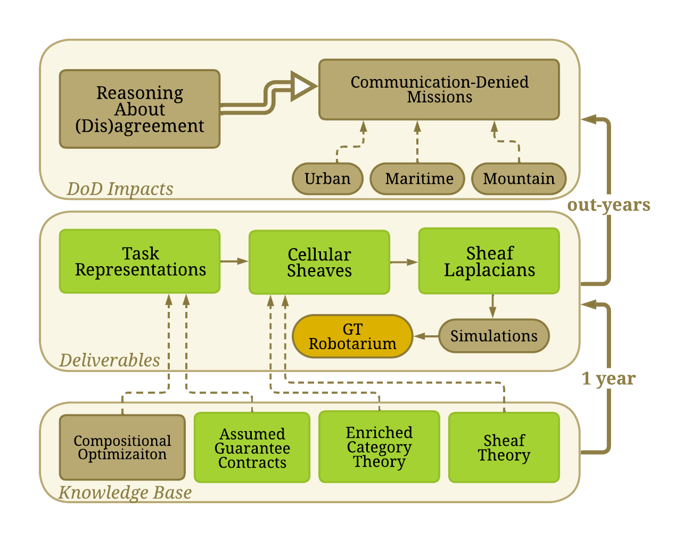{fig-align="center"}
::::

*   **Milestone 1**: Kicked the project off.
*   **Milestone 2**: Translated the task-agreement problem into a *contract sheaf*.
*   **Milestone 3**: Used the *Tarski Laplacian* to compute global sections, with convergence guarantees.
*   **Milestone 4**: Decentralized algorithm (Task 4) + experimental validation on physical UGVs at the Georgia Tech Robotarium (Task 5).
*   **Milestone 5**: COMPASS roadmap.

::: {.notes}
Milestone 4 closes the loop from mathematics to hardware: the Laplacian of MS3 becomes a running protocol, and the protocol runs on physical robots with returned footage in hand.
:::

# Mathematical Background {background-image="assets/background_section_building.jpg"}

## Assume-Guarantee Contracts

:::: {.columns}
::: {.column width="58%"}
::: {.callout-note icon="false" title="Definition"}
An **A/G contract** over an alphabet $\Sigma$ is a pair $C = (A, G)$: the environment is *assumed* to satisfy $A$; the component *guarantees* $G$ whenever the assumption holds. A contract denotes its **saturation class**: every operation acts on $\overline{G} := A \Rightarrow G$. Contracts form a bounded lattice $\mathrm{Con}(\Sigma)$:
$$(A', G') \preceq (A, G) \iff \bigl(A \Rightarrow A'\bigr) \wedge \bigl(\overline{G'} \Rightarrow \overline{G}\bigr)$$
$$C \wedge C' = \bigl(A \vee A',\, \overline{G} \wedge \overline{G'}\bigr), \qquad C \vee C' = \bigl(A \wedge A',\, \overline{G} \vee \overline{G'}\bigr)$$
:::

*   Top $\top = (\mathsf{false}, \mathsf{true})$: the **incompatible** contract — the assumptions accumulated at that agent are unsatisfiable.
*   Bottom $\bot = (\mathsf{true}, \mathsf{false})$: the **inconsistent** one — the agent holds contradictory promises.
:::
::: {.column width="42%"}
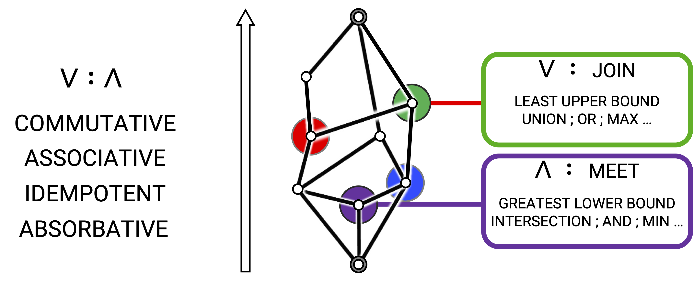{fig-align="center" width="95%"}

::: {.callout-tip title="Key Point"}
The extremes are **diagnostic values, not errors** — failure is localized to a specific agent, an accountability a monolithic consistency check cannot provide.
:::
:::
::::

::: {.notes}
All orders and equalities are decided by the Z3 SMT solver. MS2 proved contracts over a finite behavior set form a quantale; today only the lattice and the embeddings are needed.
:::

## Contract Embeddings

Let $R \subseteq X \times Y$ be a **relation between state spaces** (presented by alphabets $\Sigma_X$, $\Sigma_Y$). Four monotone *contract embeddings* — a contribution of this program, generalizing Naik et al. (2025):

$$
\begin{aligned}
R_{!}\,C &= \bigl(\forall x.\, R \Rightarrow A,\;\; \exists x.\, R \wedge \overline{G}\bigr), &
R_{\ast}\,C &= \bigl(\exists x.\, R \wedge A,\;\; \forall x.\, R \Rightarrow \overline{G}\bigr),\\
R^{\ast}\,D &= \bigl(\exists y.\, R \wedge A,\;\; \forall y.\, R \Rightarrow \overline{G}\bigr), &
R^{\circ}\,D &= \bigl(\forall y.\, R \Rightarrow A,\;\; \exists y.\, R \wedge \overline{G}\bigr)
\end{aligned}
$$

:::: {.columns}
::: {.column width="55%"}
The four maps organize into exactly **two adjunctions**:
$$R_{!} \dashv R^{\ast} \qquad\text{and}\qquad R^{\circ} \dashv R_{\ast}$$

*   $R_{!}, R_{\ast}$ are the left and right **Kan extensions** along $R$; $R^{\ast}, R^{\circ}$ their transposes.
*   An adjoint **triple** $R_{!} \dashv R^{\ast} \dashv R_{\ast}$ obtains precisely when $R$ is the graph of a **total function** — then $R^{\ast} = R^{\circ}$ collapses to substitution.
:::
::: {.column width="45%"}
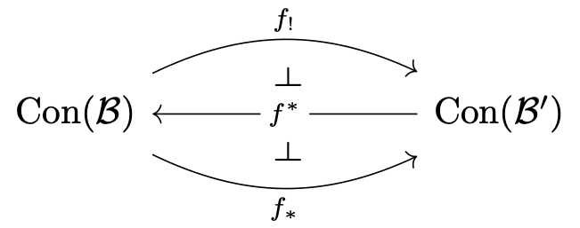{fig-align="center" width="75%"}

::: {.callout-tip title="Key Point"}
The fixed-point guarantees ride each pushforward **paired with its own adjoint**: $R_{!}$ with $R^{\ast}$, and $R^{\circ}$ with $R_{\ast}$.
:::
:::
::::

## Contract Sheaves & the Tarski Laplacian {.smaller}

::: {.callout-note icon="false" title="Definition"}
A **contract sheaf** $\mathscr{F}$ over the communication graph $G = (V, E)$ assigns to each vertex $i$ a stalk $\mathrm{Con}(\Sigma_{X_i})$, to each edge $ij$ an **interface** stalk $\mathrm{Con}(\Sigma_{Y_{ij}})$, and to each incidence $i \trianglelefteq ij$ a relation $R_{i \trianglelefteq ij} \subseteq X_i \times Y_{ij}$. A 0-cochain $x = (x_i)_{i \in V}$ is a **global section** when both endpoints of every edge push to the same interface contract:
$$(R_{i \trianglelefteq ij})_{!}\, x_i \;=\; (R_{j \trianglelefteq ij})_{!}\, x_j \qquad \text{for all } ij \in E$$
:::

*Parallel transport* carries a neighbor's contract into local coordinates — push up one restriction, pull down the other; the **Tarski Laplacian** aggregates over neighborhoods:

$$(\mathcal{L} x)_i = \bigwedge_{j \in N(i)} (R_{i \trianglelefteq ij})^{\ast} (R_{j \trianglelefteq ij})_{!}\, x_j, \qquad\qquad x[t+1] = x[t] \wedge \mathcal{L} x[t]$$

*   On finite contract lattices the flow is **monotone, terminates**, and converges to the **greatest global section below** the initial cochain; fixed points are exactly the global sections. *(A dual, ascending flow exists — appendix.)*

::: {.callout-tip title="Schedule Independence"}
Any live schedule — one hop at a time, by whichever agents are in contact — reaches the **same fixed point**: the substrate for **communication-denied operation**.
:::

::: {.notes}
In full: any asynchronous firing sequence in which every vertex broadcasts infinitely often reaches the same fixed point. The flow may be advanced one hop at a time, by whichever agents happen to be in contact, and still reaches the canonical reconciliation — this, not any centralized checker, qualifies the Laplacian as the algorithmic substrate for communication-denied operation.
:::

# Task 4: The Decentralized Algorithm

## In Plain Terms

**The maps.** Every robot carries a private, tile-by-tile picture of the world — and no two pictures agree.

**The mission sheaf.** Neighbors compare **per-room summaries, not maps**; agreement means the summaries match on every link.

**The mission contracts.** Per-room **if–then promises**: what I rely on $\to$ what I vouch for. Promises circulate; reliances are monitored.

::: {.callout-tip title="Everything that follows"}
The summary function, the A/G equations, and the protocol are this picture made precise.
:::

::: {.notes}
The maps: every robot carries a private, tile-by-tile picture of the world — targets, hazards, unknowns. No two pictures agree, and no contested link can carry a whole map.

The mission sheaf: neighbors compare summaries, not maps — a shared per-room vocabulary ("hazard somewhere in room C," "no target anywhere in room E," "my route crosses room B") with a fixed rule for boiling a map down to its summary. Agreement means the summaries match on every link: the team agrees on the mission picture without agreeing on every tile.

The mission contracts: each robot's per-room promise, in if–then form: if my route through the room stays hazard-free and no teammate claims it (what I rely on), then I vouch for my beliefs about its tiles and advertise honestly whether my route crosses it (what I promise). Promises circulate through the network; reliances are monitored — a refuted reliance triggers replanning and a fresh promise.
:::

## The Mission Sheaf (Subtask 4.1) {.smaller}

*   Agent $i$'s stalk holds a **possibility mask** $S^i_{\mathsf{q}} \subseteq \Lambda$ per tile; the interface of edge $ij$ speaks only **per region** $r \in \mathcal{R}$ — the restriction is the graph of the total *region-summary function*:

$$
F_{\ell,r} := \bigvee_{\mathsf{q} \in \rho^{-1}(r)} \bigl(S^i_{\mathsf{q}} \subseteq \{\ell\}\bigr),
\qquad
X_{\ell,r} := \bigwedge_{\mathsf{q} \in \rho^{-1}(r)} \bigl(\ell \notin S^i_{\mathsf{q}}\bigr),
\qquad
K_{i,r} := U^i_r,
\quad
K_{j,r} := O^i_{j,r}
$$

:::: {.r-stretch}
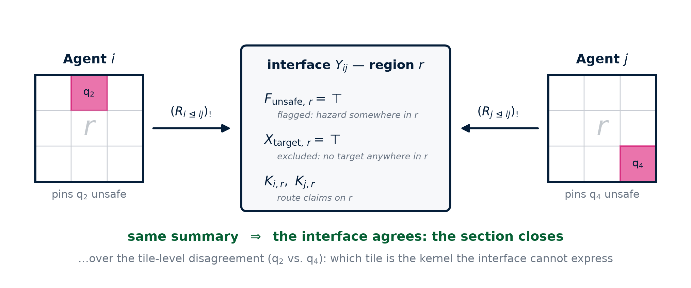{fig-align="center"}
::::

*   **Total** $\Rightarrow$ closed-form transports; **non-injective** $\Rightarrow$ the section closes *over* tile-level disagreement.
*   *Knowledge travels; ignorance stays quiet* — conflict is a **value**, never an exception.

::: {.notes}
Spoken plainly: robots keep private tile maps and compare only per-room summaries; agreement is defined on the summaries, so the team agrees on the mission picture without agreeing on every tile.

Total function ⇒ adjoint triple and both transports in closed form. Massively non-injective ⇒ which tile carries the hazard is the kernel — exactly what the interface cannot express, so the sheaf condition closes over tile-level disagreement. Two polarities are necessary: a pinned belief entails F (flagged), an all-clear entails X (excluded), silence entails neither.
:::

## The Mission Sheaf — detail {.smaller visibility="hidden"}

*   World: a $12 \times 8$ grid of tiles $\mathcal{Q}$, labels $\Lambda = \{\mathsf{target}, \mathsf{safe}, \mathsf{unsafe}\}$; Agent $i$ assigns each tile a **possibility mask** $S^i_{\mathsf{q}} \subseteq \Lambda$. Regions partition the grid via $\rho \colon \mathcal{Q} \to \mathcal{R}$ — the fibers fix *exactly which disagreements the mission tolerates*.
*   Interfaces speak only **per region** — the restriction is the graph of the total *region-summary function*:

$$
F_{\ell,r} := \bigvee_{\mathsf{q} \in \rho^{-1}(r)} \bigl(S^i_{\mathsf{q}} \subseteq \{\ell\}\bigr),
\qquad
X_{\ell,r} := \bigwedge_{\mathsf{q} \in \rho^{-1}(r)} \bigl(\ell \notin S^i_{\mathsf{q}}\bigr),
\qquad
K_{i,r} := U^i_r,
\quad
K_{j,r} := O^i_{j,r}
$$

:::: {.columns}
::: {.column width="58%"}
*   **Total function** $\Rightarrow$ adjoint triple; both transports exist in closed form.
*   **Massively non-injective** $\Rightarrow$ *which* tile of a region carries a hazard is exactly what the interface cannot express — the sheaf condition closes *over* tile-level disagreement.
*   **Two polarities are necessary**: a pinned belief entails $F$ (*flagged*), an all-clear entails $X$ (*excluded*), silence entails neither — *knowledge travels; ignorance stays quiet.*
:::
::: {.column width="42%"}
{fig-align="center"}

::: {.callout-tip title="Key Point"}
Conflict is a **value** the algebra carries — never an exception it throws.
:::
:::
::::

## Mission Contracts (Subtask 4.1)

::: {.callout-note icon="false" title="The mission contract of Agent $i$ on region $r$"}
$$
\begin{aligned}
A^i_r &= \underbrace{\bigwedge_{\mathsf{q} \in \kappa_i \cap \rho^{-1}(r)} \bigl(S^i_{\mathsf{q}} \not\subseteq \{\mathsf{unsafe}\}\bigr)}_{\text{corridor reliance}} \;\wedge\; \underbrace{\Bigl(r \in \rho(\kappa_i) \Rightarrow {\textstyle\bigwedge_{j}} \neg O^i_{j,r}\Bigr)}_{\text{exclusive claims}},\\[2pt]
G^i_r &= \underbrace{\bigwedge_{\mathsf{q} \in \mathrm{dom}(\beta_i) \cap \rho^{-1}(r)} \bigl(S^i_{\mathsf{q}} \subseteq \beta_i(\mathsf{q})\bigr)}_{\text{knowledge}} \;\wedge\; \underbrace{\bigl(U^i_r \Leftrightarrow r \in \rho(\kappa_i)\bigr)}_{\text{route pin}}
\end{aligned}
$$
where $\kappa_i$ is the corridor of Agent $i$'s current plan and $\beta_i$ its beliefs.
:::

*   *Assume*: hazard-free corridor, no competing claim. *Guarantee*: my beliefs, my honest route flag.
*   Guarantees **circulate**; assumptions are **monitored, not broadcast**.

::: {.notes}
Spoken plainly: a contract is a robot's per-room if-then promise — if what I rely on holds (hazard-free corridor, unclaimed room), then I vouch for my beliefs and my route advertisement. Promises circulate; reliances are monitored.

Why the asymmetry: guarantees are asserted unconditionally in the stalk — facts and commitments are what the Laplacian circulates. Assumptions are monitored rather than broadcast because saturation voids every promise on assumption-violating states: under the existential pushforward, an agent relying on a single unknown tile would transmit no knowledge at all.
:::

## The Protocol (Subtask 4.1)

An event-driven loop over the agent's own stalk and incident interfaces:

**Diffuse.** One hop of the flow along whichever interfaces are live.

**Monitor.** Check $A^i_r$ against the fused stalk; surcharge flagged or claimed regions.

**Replan.** Cost-to-go over believed labels, plus the overlay.

**Recommit.** New region set $\Rightarrow$ new contract, new epoch; the flow re-closes what reopened.

**Drive.** One tile at a time — on arrival, **observation overrides hearsay**.

::: {.callout-caution title="Degradation, honestly accounted"}
Denial that removes or delays contacts is **tolerated by construction**; Byzantine behavior is **not**.
:::

::: {.notes}
Diffuse: on a clock (about twice per second) while driving, and on the neighborhood of any agent about to plan. Monitor: surcharge every tile of a hazard-flagged region, or of a route region claimed by a lower-indexed neighbor — yielding by index breaks mutual-yield oscillation. Recommit: if the new corridor crosses a different set of regions, rewrite the contract — new claims, new reliance; a new epoch opens, hearsay is dropped with provenance, and the flow re-closes the sections the new commitment opened. Drive: observation may lawfully weaken the stalk; an arriving agent recommits to the empty route, freeing its regions.

Degradation in full: zero connectivity reduces to independent planning; any live schedule of partial contacts converges to the same section as full synchrony; in between, each interface closure is locally checkable — the network knows which seams remain open. Hardening fusion against adversarial (Byzantine) contracts remains future work.
:::

## Implementation & Validation (Subtask 4.2)

:::: {.columns}
::: {.column width="45%"}
The Python package `agsheaf`:

*   `contracts.py` — contracts, embeddings, Z3 refinement.
*   `sheaf.py` — Laplacians, flows, firing schedules.
*   `regionsheaf.py` / `mission.py` — one drive loop, simulator **and** testbed.

<br>

*   **Closed-form transport**: milliseconds, not 5–30 s.
*   **Per-region product**: every solver query stays small.
:::
::: {.column width="55%"}
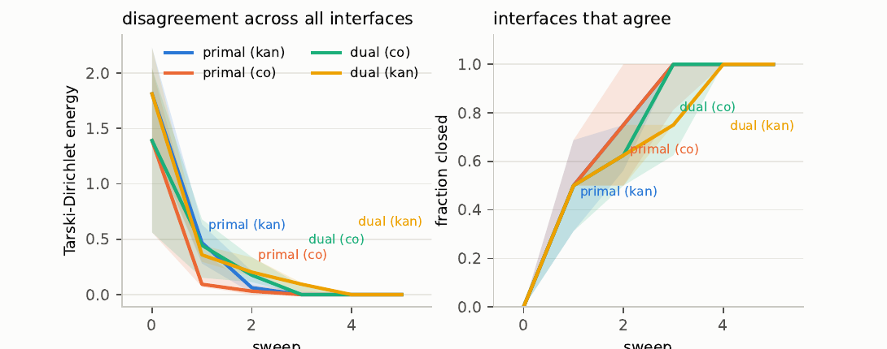{fig-align="center"}

*   **564 runs**: 99.5% converged, mean **3.3 sweeps**.
*   **32 agents**: section at **sweep 6** (diameter 14), over **1,084** tile differences.
:::
::::

::: {.notes}
Figure: randomized-ensemble campaign over all four flows (primal and dual, along each adjunction) under four firing schedules, five studies — topology, scale, coarseness, encoding, canonicalization. Median over the ensemble, shaded to the interquartile range; the energy is zero exactly when every interface agrees.

Closed-form transport: the generic Kan operators build quantified formulas Z3 cannot sustain across sweeps; totality of the summary gives exact quantifier-free forms — pullback is substitution, pushforward a finite image. Product structure: nothing couples regions, so the mission sheaf is a product of per-region sheaves; agreement is reported per (interface, region).

Schedule-independent limits were identical across all 24 (sheaf, flow) groups. The 32-agent instance closes over 1,084 tile-level differences and not one of them moves — details in the appendix.
:::

## Port to the Robotarium (Subtask 4.3)

:::: {.columns}
::: {.column width="52%"}
The testbed films from overhead and **projects the experiment's figure onto the arena floor** — the display *is* the experiment.

*   **Shared drive loop** — identical calls, identical order, local and testbed.
*   **Projection layer** — beliefs as tile fills; links colored by agreement.
*   **Build pipeline** — flat directory; append-only log ties footage to code.
:::
::: {.column width="48%"}
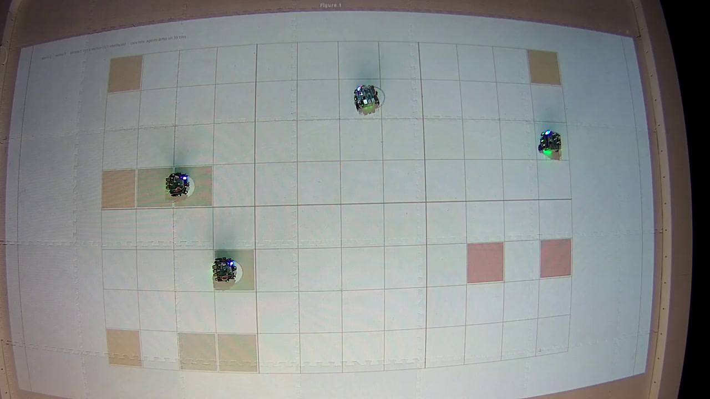{fig-align="center"}

{fig-align="center" width="80%"}
:::
::::

::: {.notes}
The Robotarium runs a submission as one flat directory against its own control stack. Drive loop: plan a tile, drive by potential-field control with collision avoidance, communicate, repeat — producing the same tiles step for step locally and on the testbed. Projection layer: region boundaries at the resolution agreement is measured, message pulses, and the two-level caption (abstract: global section? / concrete: tiles differing). Build pipeline: no subdirectories, no YAML, Z3 supplied by the executors; the append-only build log is the provenance line matching returned footage to the code that produced it, days later.
:::

# Task 5: Experimental Validation {background-image="assets/background_section_car.jpg"}

## The Demonstration World (Subtask 5.1)

:::: {.r-stretch}
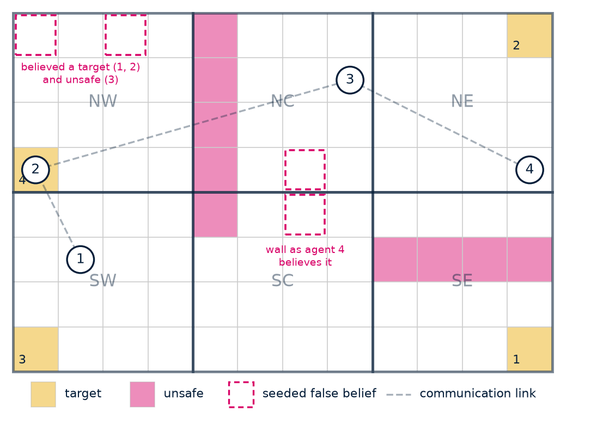{fig-align="center"}
::::

* Solid = ground truth (gold targets, pink hazards)
* Dashed = seeded **false** beliefs
* Gray = the communication chain.

::: {.notes}
A 12-by-8 grid — about 0.2 m tiles on the 3.2 m by 2.0 m arena — in six region-rooms. False beliefs are annotated by holder; communication is a three-edge chain. The scenario is deliberately adversarial toward naive consensus.
:::

## Seeded Conflicts (Subtask 5.1)

Three seeded conflicts drive the drama:

*   **Region-level conflict** — targets vs. hazards in the northwest room (Agents 1–2 vs. 3).
*   **Diameter-length correction** — Agent 4's misplaced wall; the truth sits **three hops away**.
*   **Below the vocabulary** — both walls interior to their rooms: Agent 4 is *not even wrong* at the interface's resolution.

::: {.callout-tip title="Three arms, one difference each"}
**Contract sheaf** / **no abstraction** / **no communication** — everything else held fixed. Table in the appendix.
:::

::: {.notes}
Region-level: Agents 1 and 2 believe targets stand in the northwest room where Agent 3 believes hazards — a genuine region-level conflict the interfaces must reconcile. Diameter-length: Agent 4 has the central hazard wall in the wrong column; left alone it drives into the real wall, and only Agent 1 knows better, three hops away. Below the vocabulary: the true wall and the misplaced one flag the same regions, so the sections close over the tile-level disagreement.

Arms: world, starts, assignments, beliefs, topology, planner, and scoring held fixed, so each arm isolates one ingredient.
:::

## Physical Execution (Subtask 5.2)

:::: {.columns}
::: {.column width="50%"}

**Contract-sheaf** — six-region mission sheaf
:::
::: {.column width="50%"}

**Baseline (no communication)** — private beliefs only.
:::
::::

Physical Robotarium testbed, August 12, 2026 — the projected figure beneath the robots is the toured agent's belief state.

::: {.callout-tip title="Why the sheaf arm wins"}
Alone, each robot is only as good as its partly-wrong map. With the flow, one robot's observation becomes everyone's correction — and the team *knows* when it has agreed. Paired trials: **26–75%** of the isolated-to-omniscient gap recovered.
:::

::: {.notes}
In full: alone, a robot detours around phantom hazards, drives toward phantom targets, and collides with real walls it disbelieves. With the flow, corrections propagate before they cost anyone, routes deconflict through exclusive claims, and the run carries a checkable certificate of agreement.
:::

<!-- All three arms executed end-to-end — first in the Robotarium simulator via the exact submission bundles, then on the **physical testbed** (returned overhead footage, August 12, 2026). Durations comfortably under the portal's 600 s cap: **133 s** (demonstration), **123 s** (no abstraction), **76 s** (no communication). -->


## What the Footage Shows (Subtask 5.2)

::: {.horiz}
::: {style="text-align: center; width: 24%;"}

(a) $t \approx 50$ s: flow in progress
:::
::: {style="text-align: center; width: 24%;"}
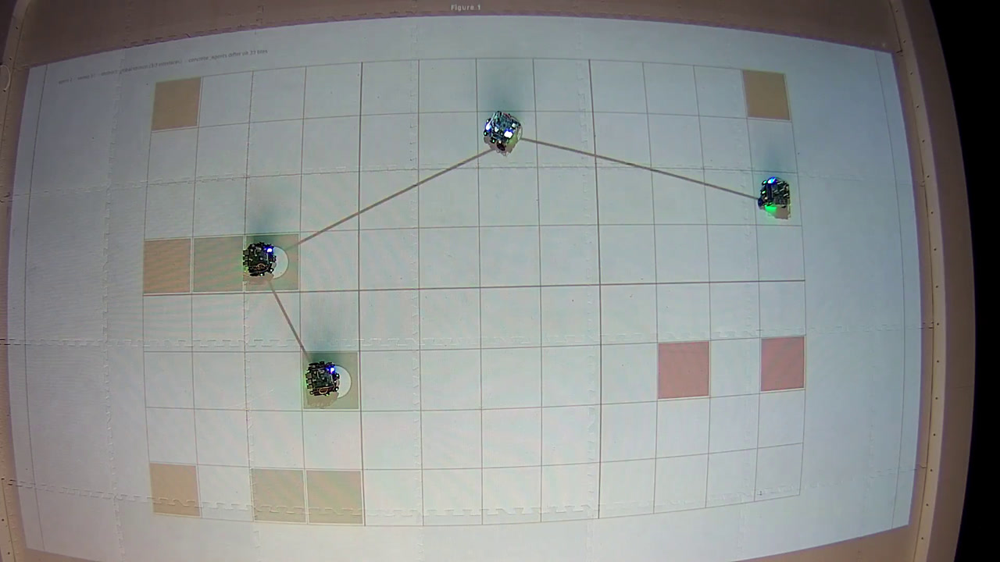
(b) $t \approx 54$ s: first global section
:::
::: {style="text-align: center; width: 24%;"}
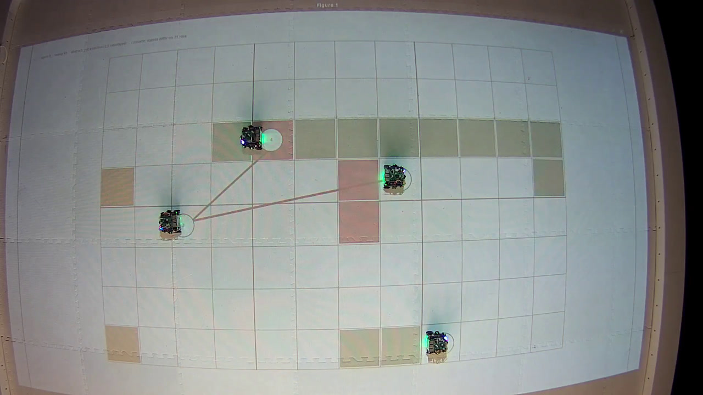
(c) $t \approx 100$ s: reopened by recommitment
:::
::: {style="text-align: center; width: 24%;"}
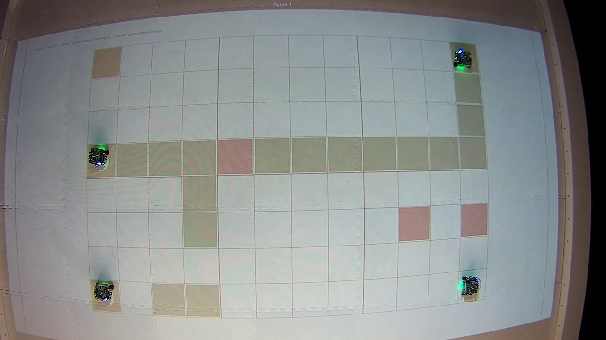
(d) $t \approx 125$ s: settled, all agents home
:::
:::

*   **Abstract agreement over concrete disagreement** — first section with 39 tiles still disputed; the run *ends* on a section with 96.
*   **Contract-driven rerouting** — 38 violations, 19 recommitments; the section indicator cycled eight times.
*   **Observation as arbiter** — 51 of 208 arrivals carried news, correcting Agent 4 hop by hop.
*   **One run, twice over** — sim and testbed agree: 39 disputed tiles at first section in both. Statistics in the appendix.

::: {.notes}
Abstract over concrete: the partition, not attrition of differences, is what agreement means here. Rerouting: each recommitment lawfully reopened closed sections the flow then re-closed — the negotiation made visible. Observation: first-hand arrivals corrected Agent 4's misplaced wall as the network's truth reached it hop by hop. Parity: the simulator's JSON log and the testbed's console log carry the same event stream — first section with exactly 39 disputed tiles in both, eight section cycles in both.
:::

## Scaling Up: Eight Agents, Every View



::: {.notes}
Eight-robot simulation of the demonstration construction: one panel per agent's evolving belief state, plus ground truth. The flow closes the interfaces while tile-level beliefs remain different — the abstraction claim, watched live at scale.
:::

## Benchmark Against MARL (Subtask 5.3) {.smaller}

:::: {.columns}
::: {.column width="48%"}
**Paired protocol**: identical worlds, starts, beliefs, topology — any difference is the policy's.

| knowledge | isolated | sheaf | omniscient |
|---|---:|---:|---:|
| 10% | 12.4 | 21.7 | 48.1 |
| 20% | 7.2 | 29.0 | 51.2 |
| 40% | 25.9 | 44.3 | 50.5 |

*   Communication recovers **26 / 50 / 75%** of the isolated-to-omniscient gap at 10 / 20 / 40% knowledge.
:::
::: {.column width="52%"}
::: {.callout-tip title="No training required"}
Every number in this briefing — the physical demo, the 564-run campaign, the 32-agent scale-up — was produced **zero-shot**: no episodes, no reward, no seeds, no sim-to-real gap. Coordination here is a **theorem, not a learned behavior**.
:::

::: {.callout-note title="MARL baseline (Subtask 5.3, pending)"}
**Independent PPO with parameter sharing** slots into the paired harness as a fourth policy — reported **with its training bill**, which is itself the contrast.
:::
:::
::::

|  | **SEAMAN (contract sheaf)** | **MARL (IPPO reference)** |
|---|---|---|
| Training | **none** — zero episodes | $10^5$–$10^7$ episodes, *per configuration* |
| New world, team size, or topology | same code, zero-shot — 4 robots $\leftrightarrow$ 32 agents | retrain |
| Guarantees | convergence theorems + **per-run certificate** | none — behavior is empirical |
| Runtime on robots | milliseconds per sweep | cheap forward pass — *not* the bottleneck |

::: {.notes}
The honest framing if pressed: MARL inference is cheap and would run on the robots fine — the runtime row concedes this deliberately. The bill is elsewhere: training (typically hundreds of thousands to millions of environment episodes for cooperative grid MARL), re-training whenever the world, team size, partition, or topology changes, and the absence of any per-run certificate — a trained policy's coordination is empirical, ours is a theorem with a checkable fixed point.

MARL baseline in full: centralized training, decentralized execution — independent PPO with parameter sharing — trained on the mission score as reward, observing exactly what a SEAMAN agent observes (own beliefs, own position, messages from graph neighbors only), evaluated on held-out worlds under the identical paired protocol. The plan of record: report its numbers alongside its training cost, so the comparison carries the asymmetry.

Table context: omniscient is the ceiling communication is trying to reach, not a runnable policy; recovery is monotone in knowledge because the flow can only redistribute what somebody knows.

If asked about arrival rate: it dips slightly under sheaf (0.74 vs 0.93 at knowledge 20%), as does omniscient (0.78) — better-informed agents detour along the same safe corridors and meet there. A standoff of shared knowledge, not of the flow; the exclusive-claims machinery breaks it, and the demonstration arm deadlocks nowhere.
:::

# Next Steps {background-image="assets/background_section_students.jpg"}

## Project Status

- [x] Task 1: Develop task representations using enriched category theory
- [x] Task 2: Construct a cellular sheaf for task compatibility
- [x] Task 3: Develop sheaf Laplacian for coordination
- [x] Task 4: Implement decentralized algorithm (4.1 design, 4.2 implementation, 4.3 Robotarium port)
- [x] Task 5: Experimental validation designed and executed end-to-end on the physical testbed
- [ ] Task 6: Create COMPASS roadmap (Milestone 5)

:::: {.r-stretch}
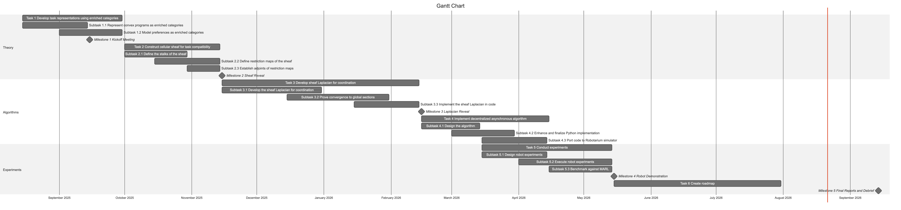{fig-align="center"}
::::

## Toward Milestone 5

::: {.callout-note title="Remaining Milestone 4 artifacts"}
*   Portal confirmation numbers for the three testbed submissions.
*   Optionally, one resubmission of the demonstration arm with the repaired logging, retrieving the JSON for the exact tile-for-tile parity check the console-log comparison approximates.
*   MARL numbers: algorithm and training budget as run, seeds, and the paired table — time to completion, score, unsafe entries, arrival rate — under identical worlds and communication constraints.
:::

*   **Milestone 5 — the COMPASS roadmap**: from the demonstrated proof of concept to a transition path — scaling the algorithm, hardening fusion against adversarial contracts, and situating contract sheaves in the layered autonomy stack.

## SMEs / Collaborators

<br>
<br>
<br>

::: {.horiz}
<!-- ::: {style="text-align: center; width: 24%;"}

Adam Pooley <br> *Georgia Tech*
::: -->

::: {style="text-align: center; width: 24%;"}

Dr. Matthew Hale <br> *Georgia Tech*
:::

<!-- ::: {style="text-align: center; width: 24%;"}

Dr. Pierluigi Nuzzo <br> *Berkeley*
::: -->

::: {style="text-align: center; width: 24%;"}

Dr. Gioele Zardini <br> *MIT*
:::
:::

## Any Questions?

<br>

:::: {.columns}
::: {.column width="40%"}
<br>
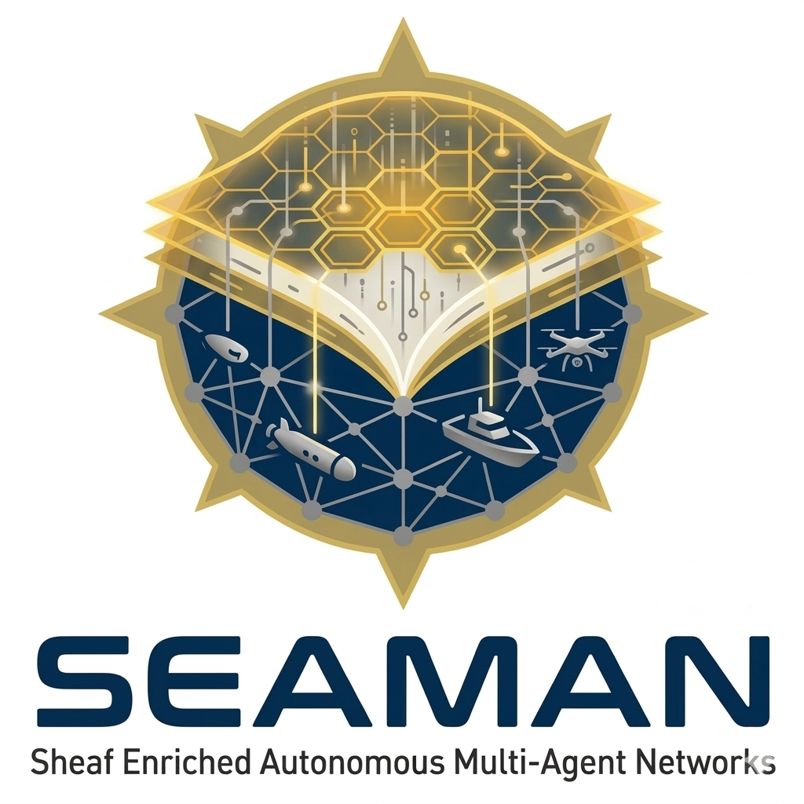
:::

::: {.column width="60%"}

:::
::::

## References

**R. Ghrist and H. Riess**, [Cellular sheaves of lattices and the Tarski Laplacian](https://link.intlpress.com/JDetail/1805805679917023234), *Homology, Homotopy and Applications*, vol. 24, no. 1, 2022.

**H. Riess and R. Ghrist**, Diffusion of information on networked lattices by gossip, *IEEE Conference on Decision and Control (CDC)*, 2022.

**R. Ghrist, M. Lopez, P. R. North, and H. Riess**, Categorical diffusion of weighted lattices, 2026.

**N. V. Naik, A. Pinto, and P. Nuzzo**, [Contract embeddings for layered control architectures](https://dl.acm.org/doi/full/10.1145/3764587), *ACM Trans. Embedded Computing Systems*, 2025.

**A. Benveniste et al.**, Contracts for system design, 2012.

**I. Incer et al.**, Pacti: Assume-guarantee contracts for efficient compositional analysis and design, 2025.

**D. Pickem et al.**, The Robotarium: A remotely accessible swarm robotics research testbed, *IEEE ICRA*, 2017.

**A. Tarski**, A lattice-theoretical fixpoint theorem and its applications, *Pacific Journal of Mathematics*, vol. 2, no. 5, 1955.

# Appendix

## The Dual Tarski Laplacian

The dual flow: $\mathcal{L}^{\scriptscriptstyle\vee}$ (ascending)
$$(\mathcal{L}^{\scriptscriptstyle\vee} x)_i = \bigvee_{j \in N(i)} (R_{i \trianglelefteq ij})^{\circ} (R_{j \trianglelefteq ij})_{\ast}\, x_j, \qquad\qquad x[t+1] = x[t] \vee \mathcal{L}^{\scriptscriptstyle\vee} x[t]$$

*   Converges to the **least fixed point above** the initial cochain, with co-sections characterized by exact $R_{\ast}$-agreement across interfaces.
*   Each Laplacian rides its own adjunction: $\mathcal{L}$ pairs $(-)^{\ast}$ with $(-)_{!}$; $\mathcal{L}^{\scriptscriptstyle\vee}$ pairs $(-)^{\circ}$ with $(-)_{\ast}$.

## `agsheaf` API {.smaller}

```python
F = ContractSheaf()
F.add_node(0, c=Contract(A0, G0))
F.add_node(1, c=Contract(A1, G1))
F.add_interface(0, 1, rel_0, rel_1)
F.laplacian_update(firing=tau)  # x <- x ^ Lx
F.converge(verify=True)
F.is_section(); F.section_edges()
```

*   Solver verdicts of *unknown* **raise** rather than default — a solver limitation is never reported as "does not refine."

::: {.callout-tip title="Measured"}
Quantifier elimination: **5–30 s** per transported contract, growing the result an order of magnitude. Closed forms: **milliseconds**, quantifier-free over a single region block; a fixture test holds them equivalent to the generic operators.
:::

## Experimental Arms & Scoring

Three arms, differing in exactly one configuration each — world, starts, assignments, beliefs, topology, planner, scoring held fixed:

| Arm | Configuration | Isolates |
|---|---|---|
| **Contract sheaf** | six-region mission sheaf, monitor on | abstraction + contracts + flow |
| **No abstraction** | identity partition ($\rho = \mathrm{id}$) | value of the region vocabulary |
| **No communication** | communication disabled | value of communicating at all |

Scoring: $+5$ per target reached, $+1$ per safe tile, $-2$ per truly-unsafe tile entered.

## One Run, Twice Over {.smaller}

:::: {.columns}
::: {.column width="45%"}
| Quantity | Simulator | Testbed |
|---|---:|---:|
| agents / arrived | 4 / 4 | 4 / 4 |
| mission score (per agent) | 59 (16/15/14/14) | — |
| assumption violations | 38 | 52 |
| arrivals (carrying news) | 208 (51) | — |
| Laplacian sweeps | 77 | 73 |
| first global section | sweep 8 | sweep 10 |
| tiles disputed at first section | **39** | **39** |
| section closed/reopened | **8 times** | **8 times** |
| recommitments | 19 | 27 |
| tiles disputed at end | 96 | 95 |
| wall-clock duration | — | 133 s |
:::
::: {.column width="55%"}
*   The simulator execution is recorded by its self-describing JSON log; the physical execution by the testbed's returned console log — the **same event stream** (sweep captions, assumption violations, recommitments).
*   The two executions tell the same story with the small divergences physical timing buys: the first global section closes with *exactly* 39 tiles in dispute in both; the section indicator cycles eight times in both.
*   The higher physical violation and recommitment counts are the negotiation **replaying under asynchronous arrival order**.

::: {.callout-caution title="One honest caveat"}
The testbed's JSON was not written: a final diagnostic print crashed on a simulator-only attribute after the experiment completed but before the log closed. The print is now guarded and moved after the close; a resubmission would return the JSON for the exact tile-for-tile parity check this comparison approximates.
:::
:::
::::


## Tarski–Dirichlet Energy at Scale {.smaller}

The **symmetric distance** $d(C,D)$ averages the measure of disagreement between assumption and saturated-guarantee state sets; the **Tarski–Dirichlet energy** of an assignment is its total disagreement measured where the sheaf condition lives:

$$
\mathcal{E}(x) \;=\; \sum_{ij \in E} d\bigl((R_{i \trianglelefteq ij})_{!}\, x_i,\; (R_{j \trianglelefteq ij})_{!}\, x_j\bigr), \qquad \mathcal{E}(x) = 0 \iff x \in \Gamma(G; \mathscr{F})
$$

{fig-align="center" width="72%"}

*   The synchronous flow closes 157 of 198 (interface, region) components on its **first sweep** and reaches a global section at **sweep 6** — well inside the diameter bound of 14 — energy falling monotonically through three decades to exactly zero. Mean 2.2 s per sweep for the whole 32-agent network.
*   The section closes over **1,084 tile-level differences** between neighboring agents' beliefs — and not one of them moves.

## Abstraction Earns Its Keep

:::: {.r-stretch}
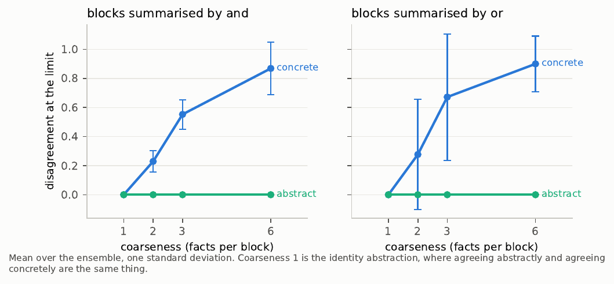{fig-align="center"}
::::

*   What the agents still disagree about lives **entirely in the kernel of the summary** — precisely what the region vocabulary was chosen to tolerate.
*   Abstract agreement is reached **over**, not by eliminating, concrete disagreement: the design's central claim about itself, quantified.
