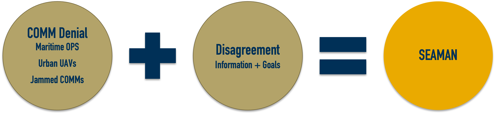
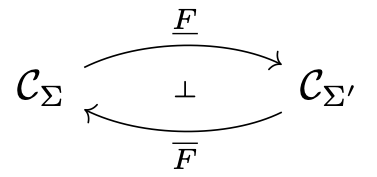
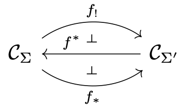
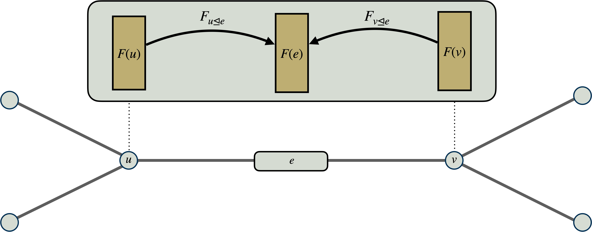
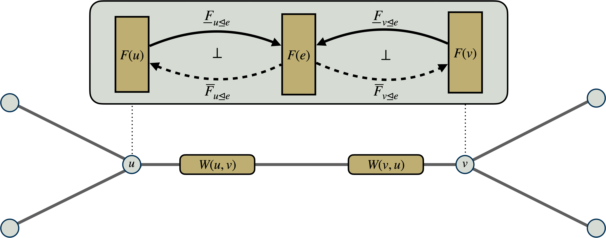
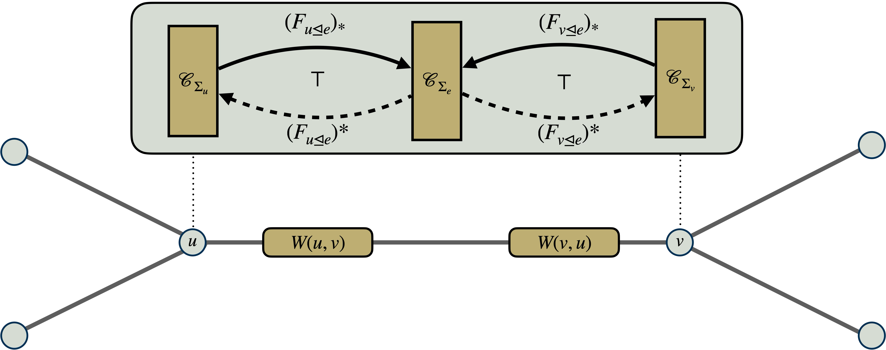
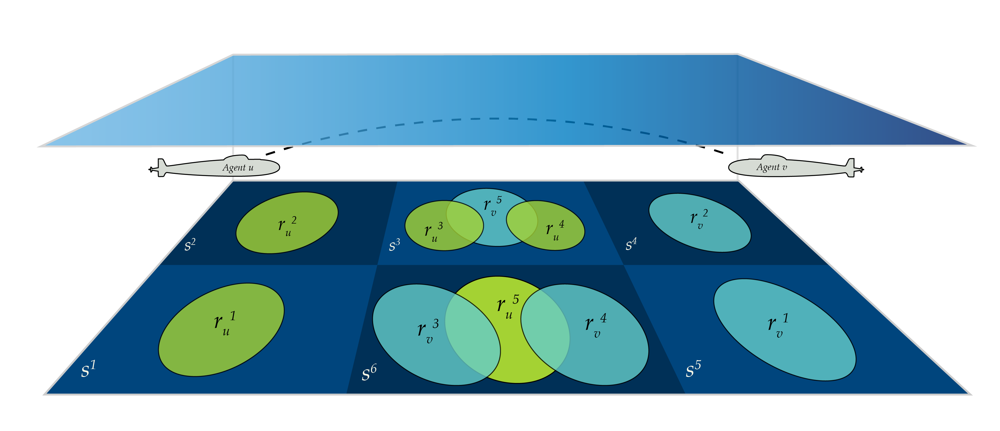
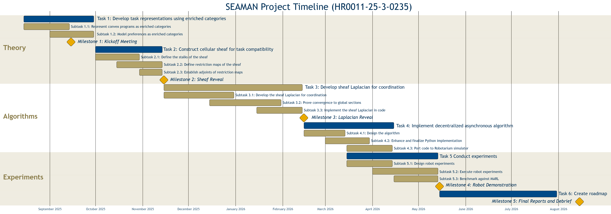
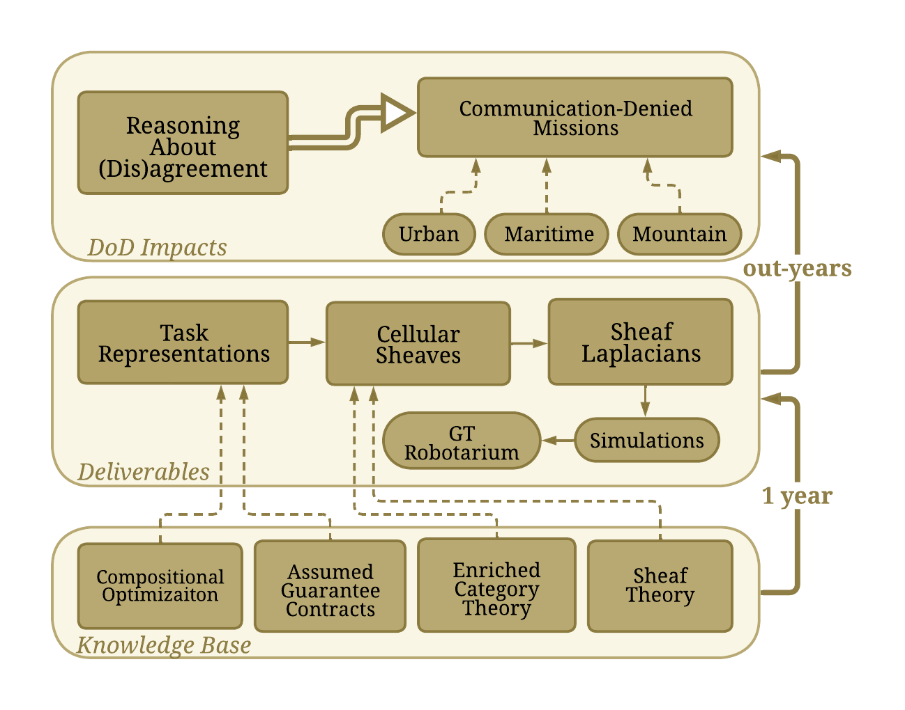
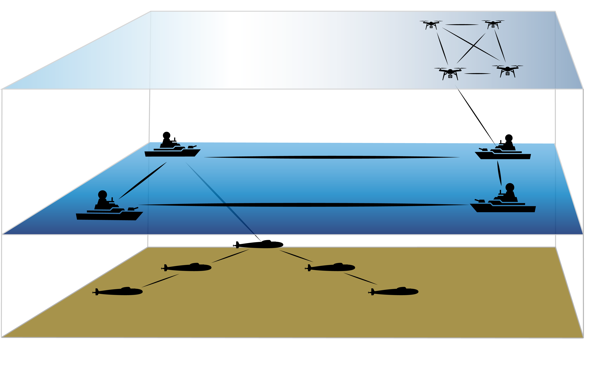

# SEAMAN Overview

## The COMPASS Problem

:::: {.columns}
::: {.column width="60%"}
*   **Context:** Multi-agent systems (UAVs/UUVs) in communication-impaired environments.
    <!-- *   UUVs communicating underwater or with surface vehicles across surface-water boundary
    *   Low-flying UAVs in urban or mountainous environment -->

*   **COMPASS Problem:** 
    * Conflicts arise in decentralized decision making
    * Disagreement about **information** and **goals**  
    * Standard network control methods such as multi-agent consensus fail for logical or task-based data.

*   **The SEAMAN solution:** 
    *   Use **cellular sheaves** to model local-to-global consistency.
    *   Use **enriched categories** to unify logical constraints, assumptions/guarantees, and numerical costs.
    *   Consistent assigments to sheaves called **global sections** represent **feasible operational plans**.

:::
::: {.column width="40%"}

:::
::::

## The SEAMAN Solution

:::: {.r-stretch}
{fig-align="center"}
::::

*   **Milestone 2**: Translate task agreement problem into a _cellular sheaf_.
*   **Milestone 3**: Use _sheaf Laplacian_ to compute global sections of the cellular sheaf.
*   **Milestone 4**: Proof-of-concept demo in the Georgia Tech Robotarium.

# Reasoning About Disagreement

## Abstractions for Mission Requirements

:::: {.columns}
::: {.column width="50%"}
* Complex multi-agent missions operate on multiple layers of abstraction.
    * **High-Level specificaiton:** *"Eventually visit Region A and avoid Region B."*
    * **Low-level controllers:** *"Find $u(t)$ such that $\dot{x} = f(x,u)$ minimizing $\int_{t_i}^{t_f} \ell\left(u(t)\right) dt$."*
* Related work on Layered Control Architectures^[N. Matni, A. D. Ames, and J. C. Doyle, “A Quantitative Framework for Layered Multirate Control: Toward a Theory of Control Architecture,” IEEE Control Systems Magazine, 2024.] ^[N. V. Naik, A. Pinto, and P. Nuzzo, “Contract Embeddings for Layered Control Architectures,” ACM Trans. Embedded Computing Systems, 2025.]

* We focus on the interface between agents
    *   **Heterogeneous:** COM, sensors, battery/computational resources, etc.
    * **Example:** *Agents with different maps rendevous in an overlapping region.* 

::: {.callout-note title="Key Point" }
_(Dis)agreement between agents is modulated by the level of abstraction._
:::
:::

::: {.column width="50%"}
{fig-align="center" width="90%"}

{fig-align="center"}
:::
::::

## Assume-Guarantee Contracts

Suppose $\mathcal{P}(\Sigma)$ is the powerset of the _variable set_ $\Sigma$ of a system.

*   **Assumptions ($A$):** The subset of valid behaviors the environment *must* provide.
    *   Initial conditions of agents
    *   Models of the environment (e.g. battlefield)
    *   Expected or desired behavior of other agents
*   **Guarantees ($G$):** The subset of behaviors the component *promises* to exhibit if assumptions are met.
    *   Tasks assigned to agents

*   **Satisfaction:**
    An agent's set of behaviors $M$ satisfies contract $c = (A,G)$, written $M \models c$, if it behaves according to $G$ whenever the environment behaves according to $A$: that is $M \cap A \subseteq G$ (equivalently, $M \subseteq A^c \cap G$)

*   **Operations on Contracts**: suppose $c_1 = (A_1,G_1)$ and $c_2 = (A_2,G_2)$
    *   *Refinement:* A contract $c_1$ refines $c_2$ written $c_1 \preceq c_2$ if $A_1 \supseteq A_2$ and $G_1 \subseteq G_2$.
    *   *Conjunction:* The conjunction is the contract $c_1 \wedge c_2 = (A_1 \cup A_2, G_1 \cap G_2)$.
    *   *Parallel Composition*: The contract $c_1 \otimes c_2 := \bigl( (A_1 \cup G_2^c) \cap (A_2 \cup G_1^c), G_1 \cap G_2 \bigr)$.

::: {.fragment .fade-up}
_$c_1 \preceq c_2$ implies that $c_1$ is "more general" then $c_2$ (i.e. $M \models c_1$ implies $M \models c_2$)._
:::
::: {.fragment .fade-up}
_$c_1 \otimes c_2$ is the "combined effort" of Agent 1 and Agent 2._
:::

##  LTL Assume-Guarantee Contracts

*   Linear Temporal Logic (LTL) formulas $\varphi :: p~\vert~\varphi \wedge \varphi'~\vert~\neg\varphi~\vert~\square~\varphi~\vert~\lozenge~\varphi$
defined inductively on _traces_ $\sigma: \mathbb{N} \to \mathcal{P}(\mathcal{A}\mathcal{P})$ where $\sigma(t)$ is the set of atomic propositions true at time $t$.
*   Semantics defined inductively
    1. $\sigma \models p$ if $p \in \sigma(0)$
    2. $\sigma \models \varphi \wedge \varphi'$ if $\sigma \models \varphi$ and $\sigma \models \varphi'$
    3. $\sigma \models \neg\varphi$ if $\sigma \not\models \varphi$
    4. $\sigma \models \square\varphi$ if $\sigma[t_0] \models \varphi$ for all $t_0 \in \mathbb{N}$ where $\sigma[t_0](t) := \sigma(t+t_0)$
    5. $\sigma \models \lozenge\varphi$ if there exists $t_0 \in \mathbb{N}$ such that $\sigma[t_0] \models \varphi$

*   Let $\Sigma:=\mathcal{P}(\mathcal{A}\mathcal{P})^\omega$ be the set of *traces*. The *behaviors* of an agent is given by the powerset $\mathcal{P}(\Sigma)$. 

*   For a formula $\varphi$, let $\llbracket\varphi\rrbracket = \{\sigma: \sigma \models \varphi\}$.
    Then, an **LTL contract** is a $c = (\llbracket\varphi_A\rrbracket,\llbracket\varphi_G\rrbracket)$ where $\varphi_A$ and $\varphi_G$ are LTL formulas, e.g. $\varphi_A = p_{\text{initial}}$ and $\varphi_G = \lozenge p_{\text{target}}$.
    <!-- i.e. "An agent guarantees that if it begins in an initial location it will eventually reach the target location." -->
* A set of traces $M \subseteq \Sigma$ _satisfies_ the contract $c = (\llbracket\varphi_A\rrbracket, \llbracket\varphi_G\rrbracket)$ if and only if $\sigma \models \varphi_A \to \varphi_G~\forall\sigma \in M$.

::: {.callout-tip}
## Other examples of A/G contracts
_Control barrier contracts_ (CBCs) guarantee forward-invariance of trajectories in a safe region. _Reachability contracts_ (RCs) guaranatee where a trajectory reaches provided it begins in an assumed set; see Naik et al., 2025.
:::

## Why Contracts?

Suppose Agent $u$ and Agent $v$ each have abstractions on $\Sigma_u$ and $\Sigma_v$ (where $\Sigma_u \neq \Sigma_v$).

Then, A/G contracts $c_u \subseteq \Sigma_u \times \Sigma_u$ and $c_v \subseteq \Sigma_v \times \Sigma_v$ cannot be (directly) compared.

::: {.callout-warning}
Agents with different abstractions "speak different languages." For example, "$c_u \preceq c_v$" and "$c_u \otimes c_v$" have no meaning when $\Sigma_u \neq \Sigma_v$.
:::

One "categorical" approach is to map _into_ a common alphabet $\Sigma_e$ with a _cospan_: $$\Sigma_u \xrightarrow{\pi_u} \Sigma_{e} \xleftarrow{\pi_v} \Sigma_v.$$

The _pullback_ is then $\{ (\sigma_u,\sigma_v): \pi(\sigma_u) = \pi(\sigma_v) \}$.
The dual approach is to map _out_ of a common alphabet $\Sigma_e$ with a _span_: $$\Sigma_u \xleftarrow{i_u} \Sigma_{e} \xrightarrow{i_v} \Sigma_v.$$

The _pushout_ is then $\Sigma_u \sqcup \Sigma_v / \sim$ where $\sigma_u \sim \sigma_v$ if there exist $\sigma_{e} \in \Sigma_{e}$ such that $i_u(\sigma_{e}) = i_v(\sigma_{e})$. 

::: {.callout-caution}
We want to map behaviors --- *subsets* of assumptions/guarantees of $\Sigma_u$ to *subsets* of assumptions/guarantees of $\Sigma_e$ --- not the *singleton* abstractions.
:::

# Quantale Enriched Categories

## Quantales

A **quantale** provides the algebraic backbone for the feasibility of an operational plan.

::: {.callout-note icon="false"  title="Definition"}
A commutative unital quantale $\mathcal{Q} := (Q, \bigvee, \cdot, 1)$ is a suplattice $(Q, \bigvee)$ equipped with an associative binary operation $\cdot: Q \times Q \to Q$ with a monoidal unit $1 \in Q$ called the _monoidal product_ such that $p \cdot  \left(\bigvee_{i \in I} q_i\right) = \bigvee_{i \in I} \left(p \cdot q_i\right)$.
:::

A quantale is guaranteed to have an _internal hom_: $[p,q]:= \bigvee \{r : r \cdot p \preceq q\}$.

| Quantale | $Q$ | $\bigvee$ | $\cdot$ | $1$ | $[p,q]$ |
| :---- | :--- | :--- | :--- | :--- | :--- |
| Booleans ($\mathcal{B}$) | $\{0,1\}$ | $\mathtt{OR}$ |$\mathtt{AND}$ | $1$ | $p \to q$ |
| Cost ($\mathcal{R}$) | $[0, \infty]$ | $\inf$ | + | 0 | $\max(q-p, 0)$ |
| Fuzzy ($\mathcal{I}$) | $[0,1]$ | $\sup$ | t-norm ($\ast$) | $1$ | Residual |
| Contracts ($\mathcal{C}_{\Sigma}$) | $\mathcal{P}^{op}(\Sigma) \times \mathcal{P}(\Sigma)$ | $\left( \bigcap_{i \in I} A_i, \bigcup_{i \in I} G_i\right)$ | $\otimes$ | $(\Sigma,\Sigma)$ | $c_2 / c_1$ |

::: {.callout-note icon="false" title="Lemma"}
Suppose $\Sigma$ is a set of variables. Then, $\mathcal{C}_{\Sigma}:=\left(\mathcal{P}(\Sigma)^{op} \times \mathcal{P}(\Sigma), \bigvee, \otimes, 1\right)$ is a quantale under the refinement order ($\preceq$) and contract compositon ($\otimes$) with monoidal unit $1 := (\Sigma,\Sigma)$.
:::

## $\mathcal{Q}$-Categories

A **$\mathcal{Q}$-category** $\mathsf{C}$ generalizes the concept of a category by replacing sets of morphisms with values from a quantale $\mathcal{Q}$. This creates a unified syntax for *logic* and *optimization*.

::: {.callout-note icon="false"  title="Definition"}
Given a quantale $\mathcal{Q}$, a $\mathcal{Q}$-category $\mathsf{C}$ consists of a set of objects $\mathrm{ob}(\mathsf{C})$ and, for every pair $x, y \in \mathsf{C}$, a hom-object $\mathrm{hom}_\mathsf{C}(x,y) \in \mathcal{Q}$ satisfying:

*   **Reflexivity:** $1 \preceq \mathrm{hom}_\mathsf{C}(x,x)$
*   **Transitivity:** $\mathrm{hom}_\mathsf{C}(y,z) \cdot \mathrm{hom}_\mathsf{C}(x,y) \preceq \mathrm{hom}_\mathsf{C}(x,z)$
:::

::: {.callout-note icon="false"  title="Definition"}
A $\mathcal{Q}$-functor $F: \mathsf{C} \to \mathsf{D}$ maps objects $x \mapsto Fx$ such that $\mathrm{hom}_\mathsf{C}(x,y) \preceq \mathrm{hom}_\mathsf{D}(Fx, Fy)$.
:::

By changing the base quantale $\mathcal{Q}$, a $\mathcal{Q}$-category models fundamentally different mathematical structures relevant to multi-agent planning.

| Quantale ($\mathcal{Q}$) | $\mathcal{Q}$-Category ($\mathsf{C}$) | hom-objects | $\mathcal{Q}$-functors
| :--- | :--- | :--- | :--- |
| Booleans ($\mathcal{B}$) | Preorder | $x \preceq y$  | Monotone |
| Cost ($\mathcal{R}$) | Lawvere Metric Space | $c(x,y)$ | Non-expansive |
| Any ($\mathcal{Q}$) | $\underline{\mathcal{Q}}$ | $[x,y]$ | $[x,y] \preceq [Fx,Fy]$

## $\mathcal{Q}$-Adjunctions

Adjunctions describe "optimal dictionaries" between different layers of abstraction. They are crucial for constructing the Sheaf Laplacian.

::: {.callout-note icon="false"  title="Definition"}
Suppose $\mathsf{C}$ and $\mathsf{C}'$ are $\mathcal{Q}$-categories.
A pair of $\mathcal{Q}$-functors $\underline{F}: \mathsf{C} \leftrightarrows \mathsf{C}'': \overline{F}$ is a **$\mathcal{Q}$-adjunction** (denoted $\underline{F} \dashv \overline{F}$) if $$\mathrm{hom}_\mathsf{D}(\underline{F}c, c') = \mathrm{hom}_\mathsf{C}(c, \overline{F} c')$$ for all $c \in \mathsf{C}, c' \in \mathsf{C}'$.
:::

In the literature, a $\mathcal{B}$-adjunction is called *Galois connection*: $\quad\quad\underline{F}(c) \preceq_{\mathsf{C}'} c' \iff c \preceq_\mathsf{C} \overline{F}(c')$.

::: {.callout-tip title="Contract Embeddings"}
We use Galois connections to link local **agent specifications** with **shared specifications** via contract embeddings:

{width="200px" fig-align="center"}

We think of...

*   $\underline{F}(c) \in \mathcal{C}_{\Sigma'}$ as being an "abstract embedding" of $c \in \mathcal{C}_{\Sigma}$
*   $\overline{F}(c') \in \mathcal{C}_{\Sigma}$ as being an "concrete embedding" of $c' \in \mathcal{C}_{\Sigma'}$
:::

## Induced Contract Embeddings

We can generate adjunctions automatically from maps $\Sigma \xrightarrow{f} \Sigma'$ (or from $\mathcal{A}\mathcal{P} \to \mathcal{A}\mathcal{P}'$).

::: {.callout-note icon="false" title="Lemma"}
Let $f: \Sigma \to \Sigma'$ be a map between variable sets. Suppose $c = (A,G) \in \mathcal{C}_\Sigma$ and $c' = (A',G') \in \mathcal{C}_{\Sigma'}$. Then, there exist $\mathcal{B}$-functors 

defined by

{width="200px" fig-align="center"}

1.  **Pullback ($f^\ast$):**
    $\quad\quad f^*(A', G') = \big(f^{-1}(A'), f^{-1}(G')\big)$
2.  **Pushforward ($f_!$):**
    $\quad\quad f_!(A, G) = \big(\{\sigma \in \Sigma' : f^{-1}(\sigma) \subseteq A\}, f(G)\big)$
3.  **Right Adjoint ($f_\ast$):** $\quad\quad f_*(A, G) = \big(f(A), \{\sigma \in \Sigma' : f^{-1}(\sigma) \subseteq G\}\big)$
:::

::: {.callout-tip title="Interpreting the Functors"}
-   $f_!(c)$ is the strongest abstract contract implementable by $c$
-   $f_\ast(c)$ is the weakest abstract contract requiring $c$.
:::

# Sheaves for Task Compatibility

## Cellular Sheaves of $\mathcal{Q}$-Categories

A sheaf attaches a "space of possibilities" to every part of the network.

Let $G=(V,E)$ be the communication graph. The _incidence category_ (poset) $\mathcal{G}$ is generated by

*   *Objects:* $V \sqcup E$
*   *Morphisms:* An arrow $v \to e$ iff vertex $v$ is incident to edge $e$ written $v \unlhd e$

::: {.callout-note icon="false" title="Definition"}
A cellular sheaf $F$ is a pseudofunctor $F: \mathcal{G} \to \mathcal{Q}\mathsf{Cat}$.
Specifically, for each $v \in V$ and $e \in E$ a sheaf $F$ assigns

*   $\mathcal{Q}$-category $F(v)$ (_stalk_)
*   $\mathcal{Q}$-category $F(e)$ (_edge stalk_)
*   $\mathcal{Q}$-functor $F_{v \unlhd e}: F(v) \to F(e)$ for each $v \unlhd e$ (_restriction map_)
:::
 

:::: {.r-stretch}
{fig-align="center"}
::::

## Consistency via Weighted Global Sections

In classical sheaf theory, "agreement" implies exact equality. In $\mathcal{Q}$-enriched sheaf theory, agreement is modulated by weights $W$ $\Rightarrow$ _approximate global sections_!

::: {.callout-note icon="false" title="Definition"}
Suppose $W: V \times V \to \mathcal{Q}$ is a weight function. The $\mathcal{Q}$-category of **$W$-weighted global sections**, denoted $\Gamma^W(\mathcal{G}; F)$, is the weighted limit of $F$. 
:::

::: {.callout-note icon="false" title="Theorem"}
Suppose $F: \mathcal{G} \to \mathcal{Q}\mathsf{Cat}$ is a cellular sheaf, and suppose $W: V \times V \to \mathcal{Q}$ is a weight. An assignment of local sections $x_u \in F(u)$ for all $u \in V$ is a **weighted global section** if for every $e = \{u,v\}$
$$
\mathrm{hom}_{F(e)}\big(F_{u \unlhd e}(x_u), F_{v \unlhd e}(x_v)\big) \succeq_{\mathcal{Q}} W(u,v)
$$
$$
\mathrm{hom}_{F(e)}\big(F_{v \unlhd e}(x_v), F_{u \unlhd e}(x_u)\big) \succeq_{\mathcal{Q}} W(v,u)
$$
:::

::: {.callout-tip icon="false" title="Example ($\mathcal{B}\mathsf{Cat}$)"}
<!-- For a sheaf of (skeletal) $\mathcal{B}$-categories, the weights determine the strictness of the agreement: -->

| $W(u,v)$ | $W(v,u)$ | Constraint |
| :--- | :--- | :--- | 
| $1$ | $1$ | $F_{u \unlhd e}(x_u) = F_{v \unlhd e}(x_v)$ |
| $1$ | $0$ | $F_{u \unlhd e}(x_u) \preceq F_{v \unlhd e}(x_v)$ |
| $0$ | $1$ | $F_{u \unlhd e}(x_u) \succeq F_{v \unlhd e}(x_v)$ |
:::

::: {.fragment .fade-down}
$\Gamma^W(G; F)$ are assignments of objects to vertices / edges compatible with restriction maps / weights.
:::

## Contract Sheaves

We define a **Contract Sheaf** as a cellular sheaf valued in $\mathcal{B}\mathsf{Cat}$.

*Stalks:* For each agent $v$, $F(v) := \mathcal{C}_{\Sigma_v}$ is the quantale of contracts over the agent's local variables $\Sigma_v$.

*Edge Stalks:* For each communication link $e=\{u,v\}$, $F(e) := \mathcal{C}_{\Sigma_{uv}}$ is the category of contracts over shared interface variables $\Sigma_{e}$ between Agent $u$ and Agent $v$.

*Restriction Maps:* Contract embeddings $\underline{F}_{u \unlhd e}: \mathcal{C}_{\Sigma_u} \to \mathcal{C}_{\Sigma_e}$ which are guaranteed to have right adjoints $\overline{F}_{u \unlhd e}: \mathcal{C}_{\Sigma_e} \to \mathcal{C}_{\Sigma_u}$.

*Global Sections:* A tuple of local contracts $(c_v)_{v \in V}$ is a **global section** if for all edges $e = \{u,v\}$
$$F_{u \unlhd e}(c_u) = F_{v \unlhd e}(c_v)$$

::: {.callout-tip}
With weights $W: V \times V \to \mathcal{B}$, we can also require refinement in either direction: $F_{u \unlhd e}(c_u) \preceq F_{v \unlhd e}(c_v)$ or $F_{u \unlhd e}(c_u) \succeq F_{v \unlhd e}(c_v)$.
:::

:::: {.r-stretch}
{fig-align="center"}
::::

## Contract Sheaves from Sets

::: {.panel-tabset}

### Left Adjoints

:::: {.r-stretch}
{fig-align="center"}
::::

Where $F: \mathcal{G} \to \mathsf{Set}$ is a cellular sheaf of sets:

*   $F(u) := \Sigma_u$
*   $F(e) := \Sigma_e$
*   $F_{u \unlhd e}: \Sigma_u \to \Sigma_e$

### Right Adjoints

:::: {.r-stretch}
{fig-align="center"}
::::

Where $F: \mathcal{G} \to \mathsf{Set}$ is a cellular sheaf of sets:

*   $F(u) := \Sigma_u$
*   $F(e) := \Sigma_e$
*   $F_{u \unlhd e}: \Sigma_u \to \Sigma_e$

:::

# Example Defense Scenario

## Mine Countermeasure Mission (MCM)

Heterogeneous UUVs must clear mines in a contest littoral zone.

*   *Global View (Interface):* The area is divided into *sectors* ($\mathcal{A}\mathcal{P}_{e}$).
*   *Local View (Agents):* Each agent uses onboard SLAM, segmenting the area into *mapped regions* ($\mathcal{A}\mathcal{P}_{u}$).

*   Agent maps differ from each other and the global map due to sensor drift and resolution.
*   They must agree on a **coverage plan** (guarantees) and **safe zones** (assumptions).

:::: {.r-stretch}
{fig-align="center"}
::::

::: {.callout-warning title="The Conflict"}
Agent $u$ assumes "Region 3 is safe," but Agent $v$ has identified a mine in its local "Region 5." Both regions physically map to "Sector 3."
:::

 

##

*Shared Variables ($\mathcal{A}\mathcal{P}_{e}$):* The sectors; common knowledge.
$\mathcal{A}\mathcal{P}_{e} = \{s^1, \dots, s^{n_\text{sectors}}\}$. 

*Local Variables ($\mathcal{A}\mathcal{P}_{u}$):* The regions mapped by agents.
$\mathcal{A}\mathcal{P}_{u} = \{r^u_1, \dots, r^u_{n_\text{regions}}\}$.

*Abstraction Maps ($f$):*
The agents know which sector their local regions belong to via functions:
$$ f_u : \mathcal{A}\mathcal{P}_{u} \to \mathcal{A}\mathcal{P}_{e} $$

*Stalks:*
$F(u) := \mathcal{C}_{\Sigma_{u}}$.
*(Contracts defined over local regions)*

*Edge Stalk:*
$F(e) := \mathcal{C}_{\Sigma_{e}}$.
*(Contracts defined over sectors)*

*Restriction Maps:*
$F_{u \unlhd e} := (f_{u})_!$

A joint operational plan is a tuple of local contracts $\mathbf{c} = (c_u)_{u \in V}$.
Is this plan feasible? Only if it forms a *global section*: 
$\mathbf{c} \in \Gamma(G; F) \iff (f_u)_!(c_u) = (f_v)_!(c_v)$ for all $\{u,v\} \in E$.

::: {.callout-warning title="Example Disagreement"}

*Agent $u$ (Assumption):* $c_u = (\lozenge r^u_3, \top)$
    *"I assume I can enter my local Region 3."*

*Agent $v$ (Guarantee):* $c_v = (\top, \square \neg r^v_5)$
    *"I guarantee I will avoid my local Region 5 (Mine Detected)."*

Agent $u$ maps Region 3 to Sector 4: $f_u(r^u_3) = s^3$

Agent $v$ maps Region 5 to Sector 4: $f_v(r^v_5) = s^3$

At $e = \{u,v\}$, the pushforward $(f_u)_!(c_u)$ requires access to $s^4$, while $(f_v)_!(c_v)$ prohibits $s^3$
:::

## Mine Countermeasure Mission (MCM)

::: {.panel-tabset}

### MCM

:::: {.r-stretch}
{fig-align="center"}
::::

### Contract Sheaf

:::: {.r-stretch}
{fig-align="center"}
::::
:::

::: {.fragment .fade-up}
How do we resolve disagreements into sections? *Standard consensus algorithms fail here.*

**Next Step:** Introduce a sheaf Laplacian & distributive algorithms to resolve inconsistencies in Milestone 3.
:::

 

# Next Steps

## Unanswered Questions

*   Most of progress has been with sheaves valued in $\mathcal{B}$-categories.
    *   What about sheaves for other $\mathcal{Q}$-categories, especially for compositional optimization?
    *   Quantitative semantics of signal temporal logic (STL) or metric interval temporal logic (MITL)
    *   Interpret $\mathcal{C}_{\Sigma}$-categories as contract networks?
*   Adjunctions between $\mathcal{C}_{\Sigma}$ and $\mathcal{C}_{\Sigma'}$ induced by functions $\Sigma \to \Sigma'$:
    *   Good examples in SLAM
    *   Other techniques for adjunctions?
*   For contract sheaves, global sections are assignments of contracts with exact agreement over edges
    *   We may want other constraints over edges besides equality
    *   Other weightings possible for other $\mathcal{Q}$, for example $\mathcal{I}$ (fuzzy) or $\underline{\mathcal{C}_{\Sigma}}$ (internal contracts)

::: {.callout-tip title="Definition of Success"}

*   A novel MAS planning algorithm emerged because of use of enriched categories & sheaves.
*   New algorithm show to have advantages over MARL in both simulations and Robotarium experiments.
*   In out years, the algoirthm is embedded in our autonomous defnse systems.
:::

## Project Status

- [x] Task 1: Develop task representations using enriched category theory
- [x] Task 2: Construct a cellular sheaf for task compatibility
- [ ] Task 3: Develop sheaf Laplacian for coordination
- [ ] Task 4: Implement decentralized (asynchronous?) algorithm
- [ ] Task 5: Conduct experimental validation
- [ ] Task 6: Create COMPASS roadmap

:::: {.r-stretch}
{fig-align="center"}
::::

 

## Subject Matter Experts (SMEs)

 
 
 

::: {.horiz}
::: {style="text-align: center; width: 24%;"}

Dr. Matthew Hale   *Georgia Tech*
:::

::: {style="text-align: center; width: 24%;"}

Dr. Pierluigi Nuzzo   *Berkeley*
:::

::: {style="text-align: center; width: 24%;"}

Dr. Paige North   *Utrecht*
:::

::: {style="text-align: center; width: 24%;"}

Dr. Gioele Zardini   *MIT*
:::
:::

## Any Questions?

:::: {.columns}
::: {.column width="40%"}

:::

::: {.column width="60%"}

:::
::::

:::: {.columns}
::: {.column width="50%"}

:::

::: {.column width="50%"}
{width=75% fig-align=center}
:::
::::

## References

**R. Ghrist, M. Lopez, P. R. North, and H. Riess**, [Categorical diffusion of weighted lattices](https://arxiv.org/abs/2501.03890), *arXiv:2501.03890*, 2026.

**R. Ghrist and H. Riess**, [Cellular sheaves of lattices and the Tarski Laplacian](https://link.intlpress.com/JDetail/1805805679917023234), *Homology, Homotopy and Applications*, vol. 24, no. 1, 2022.

**N. V. Naik, A. Pinto, and P. Nuzzo**, [Contract embeddings for layered control architectures](https://dl.acm.org/doi/full/10.1145/3764587), *ACM Trans. Embedded Computing Systems*, 2025.

**F. W. Lawvere**, [Metric spaces, generalized logic, and closed categories](https://link.springer.com/article/10.1007/BF02924844), *Rendiconti del Seminario Matematico e Fisico di Milano*, vol. 43, pp. 135–166, 1973.

**S. Abramsky and S. Vickers**, [Quantales, observational logic and process semantics](https://doi.org/10.1017/S0960129500000189), *Mathematical Structures in Computer Science*, vol. 3, no. 2, 1993.