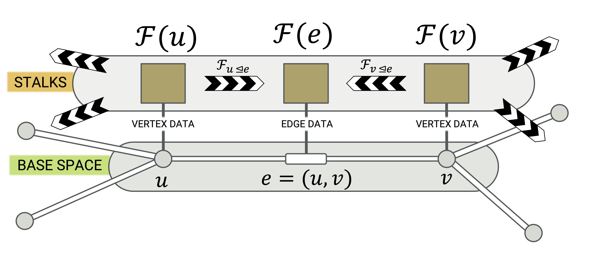
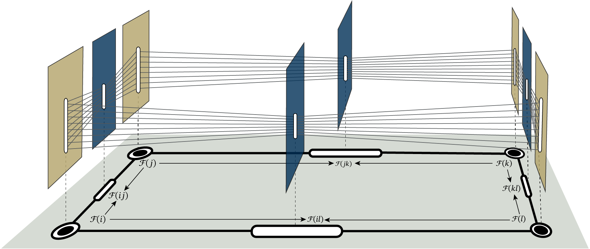
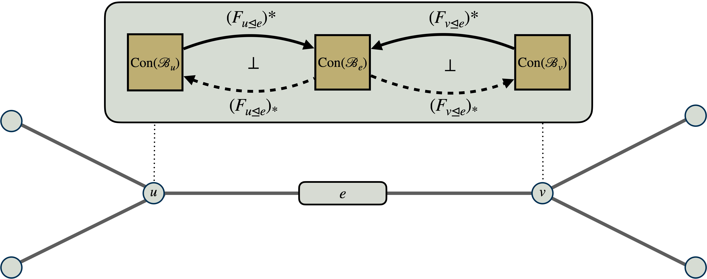
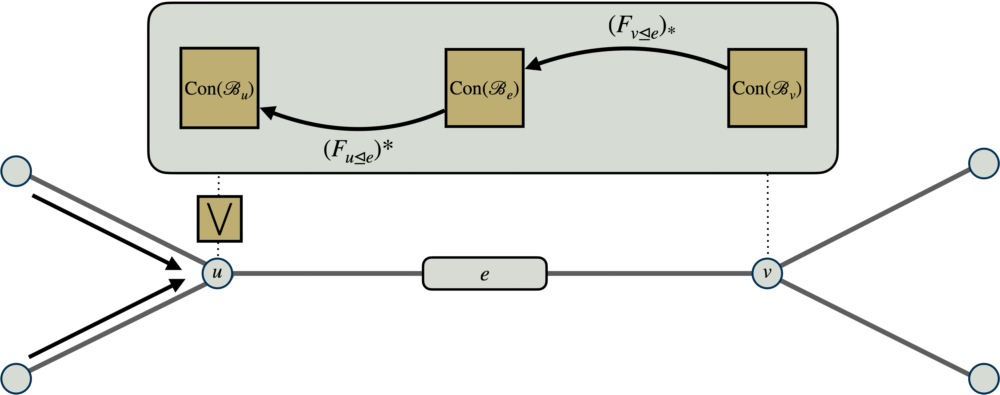
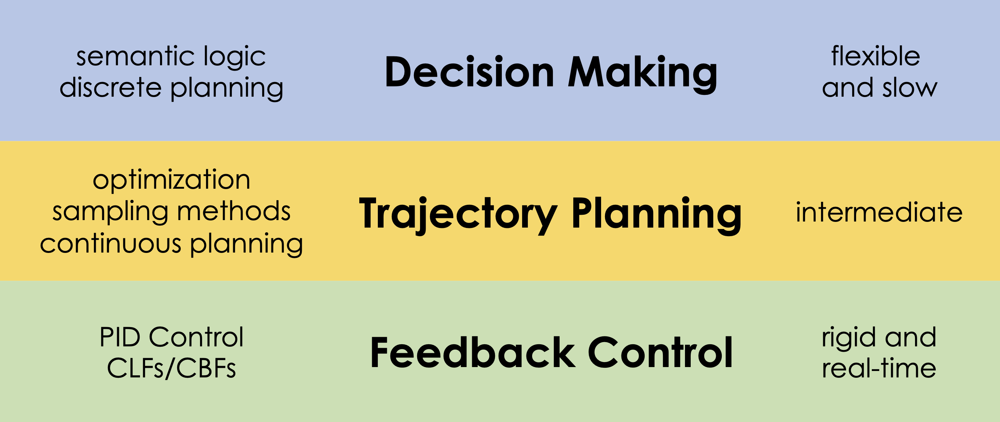
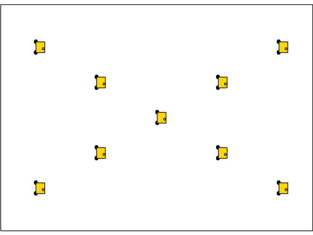

# SEAMAN Overview

## The COMPASS Problem

:::: {.columns}
::: {.column width="60%"}
*   **Context:** Multi-agent systems (UAVs/UUVs) in communication-impaired environments.
    <!-- *   UUVs communicating underwater or with surface vehicles across surface-water boundary
    *   Low-flying UAVs in urban or mountainous environment -->

*   **COMPASS Problem:** 
    * Conflicts arise in decentralized decision making
    * Disagreement about **information** and **goals**  
    * Standard network control methods such as multi-agent consensus fail for logical or task-based data.

*   **The SEAMAN solution:** 
    *   Use **cellular sheaves** to model local-to-global consistency.
    *   Use **enriched categories** to unify logical constraints, assumptions/guarantees, and numerical costs.
    *   Consistent assigments to sheaves called **global sections** represent **feasible operational plans**.


:::
::: {.column width="40%"}


:::
::::

## The SEAMAN Solution

:::: {.r-stretch}
{fig-align="center"}
::::

*   **Milestone 1**: Kicked the project off.
*   **Milestone 2**: Translate task agreement problem into a _cellular sheaf_.
*   **Milestone 3**: Use _sheaf Laplacian_ to compute global sections of the cellular sheaf.
*   **Milestone 4**: Proof-of-concept demo in the Georgia Tech Robotarium.
*   **Milestone 5**: COMPASS Roadmap.

# Assume-Guarantee Contracts

## Abstractions for Mission Requirements {visibility="hidden"}

:::: {.columns}
::: {.column width="50%"}
* Complex multi-agent missions operate on multiple layers of abstraction.
    * **High-Level specificaiton:** *"Eventually visit Region A and avoid Region B."*
    * **Low-level controllers:** *"Find $u(t)$ such that $\dot{x} = f(x,u)$ minimizing $\int_{t_i}^{t_f} \ell\left(u(t)\right) dt$."*
* Related work on Layered Control Architectures^[N. Matni, A. D. Ames, and J. C. Doyle, “A Quantitative Framework for Layered Multirate Control: Toward a Theory of Control Architecture,” IEEE Control Systems Magazine, 2024.] ^[N. V. Naik, A. Pinto, and P. Nuzzo, “Contract Embeddings for Layered Control Architectures,” ACM Trans. Embedded Computing Systems, 2025.]

* We focus on the interface between agents
    *   **Heterogeneous:** COM, sensors, battery/computational resources, etc.
    * **Example:** *Agents with different maps rendevous in an overlapping region.* 

::: {.callout-note title="Key Point" }
_(Dis)agreement between agents is modulated by the level of abstraction._
:::
:::

::: {.column width="50%"}
{fig-align="center" width="90%"}

{fig-align="center"}
:::
::::

## Order Theory Background

::: {.callout-note icon="false" title="Definition"}
A **partial order** $(P,\preceq)$ is a set together with transitive, reflexive, anti-symmetric relation.
A **suplattice** is a partially ordered set $(P, \preceq)$ in which every subset $S \subseteq P$ has a least upper bound (supremum) $\textstyle\bigvee S \in L$.
:::

{fig-align="center" width="90%"}

::: {.callout-note icon="false" title="Definition"}
A **Galois connection** between partial orders $(P, \preceq_P)$ and $(Q, \preceq_Q)$ is a pair of monotone maps
$$\underline{f}: P \leftrightarrows Q : \overline{f}$$
satisfying $\underline{f}(p) \preceq_Q q \iff p \preceq_P \overline{f}(q)$ for all $p \in P$, $q \in Q$. $\underline{f}$ (left) and $\overline{f}$ (right) are _adjoints_ written $\underline{f} \dashv \overline{f}$.
:::

::: {.callout-note icon="false" title="Definition"}
The category $\mathsf{Sup}$ has _objects_ = suplattices $(L,\preceq,\vee)$ and _morphisms_ = left adjoints.
Every morphism $\underline{f}: L \to M$ in $\mathsf{Sup}$ has a unique right adjoint $\overline{f}: M \to L$ given by
$\overline{f}(y) = \bigvee \{x \in L : \underline{f}(x) \preceq y\}$. Suplattices and right adjoints make up the category $\mathsf{Inf}$.
:::

<br>


## Assume-Guarantee Contracts

* **Behaviors ($\mathcal{B}$)**: All possible behaviors of an agent (including interactions with other agents / environment) 

   * Set of traces $\mathcal{B}_{\Sigma} = \{\tau: \mathbb{N} \to 2^\Sigma\}$
   * $\Sigma$ is a set of boolean variables, e.g. `in_region_A_is_true`, sommetimes called an _alphabet_
   * A _behavior_ is a $M \subseteq \mathcal{B}$

*   **Assumptions ($A \subseteq \mathcal{B}$):** The subset of valid behaviors the environment *must* provide.
    *   Initial conditions of agents
    *   Models of the environment (e.g., contested area)
    *   Expected or desired behavior of other agents (e.g., collision avoidance, coordination)
*   **Guarantees ($G \subseteq \mathcal{B}$):** The subset of behaviors the component *promises* to exhibit if assumptions met.
    *   Tasks assigned to agents (e.g., travel from Region A to Region B, avoiding Region C)

*   **Satisfaction ($\models$):**
    An agent's set of behaviors $M$ satisfies contract $\mathcal{C} = (A,G)$, written $M \models \mathcal{C}$, if it behaves according to $G$ whenever the environment behaves according to $A$: that is $M \cap A \subseteq G$ (equivalently, $M \subseteq \neg A \cap G$)

*   **Operations on Contracts ($\preceq, \wedge, \otimes$)**: suppose $\mathcal{C}_1 = (A_1,G_1)$ and $\mathcal{C}_2 = (A_2,G_2)$
    *   *Refinement:* A contract $\mathcal{C}_1$ refines $\mathcal{C}_2$ written $\mathcal{C}_1 \preceq \mathcal{C}_2$ if $A_1 \supseteq A_2$ and $G_1 \subseteq G_2$.
    *   *Conjunction:* The conjunction is the contract $\mathcal{C}_1 \wedge \mathcal{C}_2 = (A_1 \cup A_2, G_1 \cap G_2)$.
    *   *Parallel Composition*: The contract $\mathcal{C}_1 \otimes \mathcal{C}_2 := \bigl( (A_1 \cup \neg G_2) \cap (A_2 \cup \neg G_1), G_1 \cap G_2 \bigr)$.

::: {.notes}
* $\mathcal{C}_1 \preceq \mathcal{C}_2$ implies that $\mathcal{C}_1$ is "more general" then $\mathcal{C}_2$ (i.e. $M \models \mathcal{C}_1$ implies $M \models \mathcal{C}_2$).
* $\mathcal{C}_1 \otimes \mathcal{C}_2$ is the "combined effort" of Agent 1 and Agent 2.
:::

##  LTL Assume-Guarantee Contracts

*   Linear Temporal Logic (LTL) formulas $\varphi :: p~\vert~\varphi \wedge \varphi'~\vert~\neg\varphi~\vert~\square~\varphi~\vert~\lozenge~\varphi$
defined inductively on _traces_ $\tau: \mathbb{N} \to \mathcal{P}(\Sigma)$ where $\tau(t)$ is the set of atomic propositions true at time $t$.
*   Semantics defined inductively
    1. $\tau \models p$ if $p \in \tau(0)$
    2. $\tau \models \varphi \wedge \varphi'$ if $\tau \models \varphi$ and $\tau \models \varphi'$
    3. $\tau \models \neg\varphi$ if $\tau \not\models \varphi$
    4. $\tau \models \square\varphi$ if $\tau[t_0] \models \varphi$ for all $t_0 \in \mathbb{N}$ where $\tau[t_0](t) := \tau(t+t_0)$
    5. $\tau \models \lozenge\varphi$ if there exists $t_0 \in \mathbb{N}$ such that $\tau[t_0] \models \varphi$

*   Let $\mathcal{B}_{\Sigma}:=\mathcal{P}(\Sigma)^\omega$ be the set of *traces*. A *behavior* of an agent is a subset $M \subseteq \mathcal{B}_\Sigma$. 

*   For a formula $\varphi$, let $\llbracket\varphi\rrbracket = \{\tau: \tau \models \varphi\}$.
    Then, an **LTL contract** is a $\mathcal{C} = (\llbracket\varphi_A\rrbracket,\llbracket\varphi_G\rrbracket)$ where $\varphi_A$ and $\varphi_G$ are LTL formulas, e.g. $\varphi_A = p_{\text{initial}}$ and $\varphi_G = \lozenge p_{\text{target}}$.
    <!-- i.e. "An agent guarantees that if it begins in an initial location it will eventually reach the target location." -->
* A behavior $M$ _satisfies_ the contract $\mathcal{C} = (\llbracket\varphi_A\rrbracket, \llbracket\varphi_G\rrbracket)$ if and only if $\sigma \models \varphi_A \to \varphi_G~\forall\sigma \in M$.

::: {.callout-tip}
## Other examples of A/G contracts
_Control barrier contracts_ (CBCs) guarantee forward-invariance of trajectories in a safe region. _Reachability contracts_ (RCs) guaranatee where a trajectory reaches provided it begins in an assumed set; see Naik et al., 2025.
:::

## Why Contract Sheaves?

> Agents speak differnet "languages." Sheaves translate.

* Heterogeneous agents Agent $u$ and Agent $v$ each have different sets of behaviors $\mathcal{B}_u$ and $\mathcal{B}_v$
* A/G contracts $\mathcal{C}_u \in \mathrm{Con}(\mathcal{B}_U)$ and $\mathcal{C}_v \in \mathrm{Con}(\mathcal{B}_v)$ cannot be compared
* Doesn't make sense to ask $M \models \mathcal{C}_u$ if $M \subseteq \mathcal{B}_v$

> Different languages means shared meaning occurs in an "interface of abstraction."

::: {.callout-tip title="Definition of Success"}

*   A novel MAS planning algorithm emerged because of use of enriched categories & sheaves.
*   New algorithm show to have advantages over MARL in both simulations and Robotarium experiments.
*   In out years, the algoirthm is embedded in our autonomous defense systems.
:::

## Contract Embeddings

Suppose $f: \mathcal{B} \to \mathcal{B}'$ is a mapping from sets of behaviors, e.g. $f: \mathcal{B}_{\Sigma} \to \mathcal{B}_{\Sigma'}$ induced by a $\Sigma \to \Sigma'$

* $\mathcal{B}$, concrete set of behaviors (e.g. trajectories in gridworld)
* $\mathcal{B}'$, abstract set of behaviors (e.g. linear temporal logic tasks)

A contract embedding^[N. V. Naik, A. Pinto, and P. Nuzzo, “Contract Embeddings for Layered Control Architectures,” ACM Trans. Embedded Computing Systems, 2025.] consists of the following

{width="35%" fig-align="center"}

:::: {.columns}

::: {.column width=50%}

* $f_{!}(A,G) = \bigl( \forall_f(A), \exists_f(G)  \bigr)$
* $f^\ast(A',G') = \bigl( f^{-1}(A'), f^{-1}(G')  \bigr)$
* $f_\ast(A,G) = \bigl( \exists_f(A), \forall_f(G)  \bigr)$

:::

::: {.column width=50%}
* $f_\exists(M) = \{ b' \in \mathcal{B}': \exists m \in M, f(m) = b'\}$ $\quad \quad \quad = f(M)$
* $f_\forall(M) = \{b' \in \mathcal{B}': \forall m \in \mathcal{B}, (f(m) = b' \implies m \in M )\}$ $\quad \quad \quad = \{ b' \in \mathcal{B}': f^{-1}(b') \subseteq M\}$
:::
::::

<!-- ::: {.callout-note icon="false" title="Lemma"}
Given $f: \mathcal{B} \to \mathcal{B}'$, there exist Galois connection $f_\exists \dashv f^\ast \dashv

defined by

{width="200px" fig-align="center"}

1.  **Pullback ($f^\ast$):**
    $\quad\quad f^*(\mathcal{C}') = \big(f^{-1}(A'), f^{-1}(G')\big)$
2.  **Pushforward ($f_!$):**
    $\quad\quad f_!(\mathcal{C}) = \big(\{\sigma \in \Sigma' : f^{-1}(\sigma) \subseteq A\}, f(G)\big)$
3.  **Right Adjoint ($f_\ast$):** $\quad\quad f_*(\mathcal{C}) = \big(f(A), \{\sigma \in \Sigma' : f^{-1}(\sigma) \subseteq G\}\big)$
::: -->

::: {.notes}
-   $f_!(\mathcal{C})$ is the strongest abstract contract implementable by $\mathcal{C}$
-   $f_\ast(\mathcal{C})$ is the weakest abstract contract requiring $\mathcal{C}$.
:::

# Contract Sheaves

## Sheaves

> The purpose of sheaf theory is quite general: it is to obtain global information from local information, or else to define “obstructions” which characterize the fact that a local property does not hold globally any more.---Kashiwara & Schapira in _Sheaves on Manifolds_


{fig-align="center" style="center; width: 150%"}


## Sheaves

> The purpose of sheaf theory is quite general: it is to obtain global information from local information, or else to define “obstructions” which characterize the fact that a local property does not hold globally any more.---Kashiwara & Schapira in _Sheaves on Manifolds_

<br>
<br>

#### Sheaves in the category of suplattices

:::: {.callout-note icon="false" title="Definition"}
Suppose $G=(V,E)$ is an undirected communication graph with vertex-set $V$ and edge-set $E$. The incidence order is the partial order $\mathsf{P}(G) = (V \sqcup E, \unlhd)$ generated by $v \unlhd e$ iff $v \in e$.

A **cellular sheaf** $\mathcal{F}$ over $G$ valued in $\mathsf{Sup}$ is an assignment $\mathcal{F}: \mathsf{P}(G) \to \mathsf{Sup}$ of suplattices and Galois connections:

*   A suplattice $\mathcal{F}(v)$ called a _stalk_ for every $v \in V$ 
*   A suplattice $\mathcal{F}(e)$ called an _edge stalk_ for every $e \in E$ 
*   Two Galois connections
$$ \underline{\mathcal{F}}_{u \unlhd e}: \mathcal{F}(u) \leftrightarrows \mathcal{F}(e): \overline{\mathcal{F}}_{u \unlhd e} \quad \quad  \underline{\mathcal{F}}_{v \unlhd e}: \mathcal{F}(v) \leftrightarrows \mathcal{F}(e): \overline{\mathcal{F}}_{v \unlhd e} \quad \quad \forall e = \{u,v\} \in E$$

::::

## Mental Model {visibility="hidden"}

{fig-align="center" style="center; width: 120%"}


## Contract Sheaves

:::: {.callout-note icon="false" title="Definition"}
Suppose $G=(V,E)$ is a communication graph. Suppose $F: \mathsf{P}(G)^{op} \to \mathsf{FinSet}$ is a cellular cosheaf of finite sets and functions.

* $F(v) := \mathcal{B}_v$ is the concrete set of agent behaviors
* $F(e) := \mathcal{B}_e$ is the abstract set of shared behaviors.
* $F_{v \unlhd e}: \mathcal{B}_e \to \mathcal{B}_v$ maps abstract behaviors to concrete behaviors.

A **contract sheaf** $F$ over $G$ is sheaf of suplattices $\mathcal{F}: \mathsf{P}(G) \to \mathsf{Sup}$ of A/G contracts and contract embeddings:
<!-- (inflattices $\mathcal{F}: \mathsf{P}(G) \to \mathsf{Sup}$)  -->

*   $\mathcal{F}(v) := \mathrm{Con}(\mathcal{B}_v)$ for every $v \in V$
*   $\mathcal{F}(e) := \mathrm{Con}(\mathcal{B}_e)$ for every $e \in E$
*   Two Galois connections
$$\underline{\mathcal{F}}_{u \unlhd e} :=  (F_{u \unlhd e})^\ast:  \mathrm{Con}(\mathcal{B}_{u}) \leftrightarrows \mathrm{Con}(\mathcal{B}_e): (F_{u \unlhd e})_{\ast}=: \overline{\mathcal{F}}_{u \unlhd e} \quad \underline{\mathcal{F}}_{v \unlhd e} :=  (F_{v \unlhd e})^\ast:  \mathrm{Con}(\mathcal{B}_{v}) \leftrightarrows \mathrm{Con}(\mathcal{B}_e): (F_{v \unlhd e})_{\ast}=: \overline{\mathcal{F}}_{v \unlhd e}  \quad \forall e = \{u,v\}$$
::::

#### Global sections measure task agreement

:::: {.callout-note icon="false" title="Definition"}
A tuple of local contracts $(\mathcal{C}_v)_{v \in V}$ is a *global section* if for all edges $e = \{u,v\}$
$$\underline{F}_{u \unlhd e}(\mathcal{C}_u) = \underline{F}_{v \unlhd e}(\mathcal{C}_v)$$

Let $\Gamma(G;\mathcal{F})$ be the set of all global sections.
::::

<!-- {fig-align="center" style="center; width: 120%"} -->

## Contract Sheaf Duality

::: {.panel-tabset}

### Left: $(-)_{!}$

:::: {.r-stretch}
{fig-align="center"}
::::

Where $F: P(G) \to \mathsf{FinSet}$ is a cellular sheaf of finite sets.

### Right: $(-)_{\ast}$


:::: {.r-stretch}
{fig-align="center"}
::::

Where $F: P(G) \to \mathsf{FinSet}$ is a cellular sheaf of finite sets.

### Left: $(-)^{\ast}$

:::: {.r-stretch}
{fig-align="center"}
::::

Where $F: P(G)^{op} \to \mathsf{FinSet}$ is a cellular cosheaf of finite sets.


### Right: $(-)^{\ast}$


:::: {.r-stretch}
{fig-align="center"}
::::

Where $F: P(G)^{op} \to \mathsf{FinSet}$ is a cellular cosheaf of finite sets.

:::


# Sheaf Laplacians

## The Tarski Laplacian

For a cellular sheaf $\mathcal{F}: \mathsf{P}(G) \to \mathsf{Sup}$ of suplattices & left adjoints of Galois connections.

::: {.callout-note icon="false" title="Definition (Ghrist–Riess 2022)"}
The **Tarski Laplacian**^[**R. Ghrist and H. Riess**, Cellular sheaves of lattices and the Tarski Laplacian, *Homology, Homotopy and Applications*, vol. 24, no. 1, 2022.] $L$ is the operator on assignments $(s_v)_{v \in V}$ with $s_v \in \mathcal{F}(v)$ defined component-wise by
$$
(Ls)_v := \bigwedge_{e = \{v,w\}} \overline{\mathcal{F}}_{v \unlhd e}\!\left( \underline{\mathcal{F}}_{w \unlhd e}(s_w) \right).
$$
:::

::: {.callout-note icon="false" title="Hodge-Tarski Theorem (Ghrist–Riess 2022)"}
An assignment $(s_v)_{v \in V}$ is a **global section** if and only if $s_v \preceq (Ls)_v$ for all $v \in V$.


:::

*  Corollary: $\Gamma(G; \mathcal{F}) \neq \emptyset$ is a suplattice by Tarski Fixed Point Theorem^[**A. Tarski**, A lattice-theoretical fixpoint theorem and its applications, _Pacific Journal of Mathematics_, vol. 2, no. 5, 1955.].
* Corollary: $s^{(k+1)} = s^{(k)} \wedge L s^{(k)}$ converges to global section.

## Tarski Laplacian of Contract Sheaves

::: {.panel-tabset}

### Left: $(-)_{!}$

:::: {.r-stretch}
{fig-align="center"}
::::

$$(L \mathcal{C})_u = \bigwedge_{e = \{u,v\}} (F_{v \unlhd e})^{\ast} \bigl( (F_{u \unlhd e})_{!} (\mathcal{C}_v)\bigr)$$


### Right: $(-)_{\ast}$

:::: {.r-stretch}
{fig-align="center"}
::::

$$(L \mathcal{C})_u = \bigvee_{e = \{u,v\}} (F_{v \unlhd e})^{\ast} \bigl( (F_{u \unlhd e})_{\ast} (\mathcal{C}_v)\bigr)$$


### Left: $(-)^{\ast}$

:::: {.r-stretch}
{fig-align="center"}
::::

$$(L \mathcal{C})_u = \bigwedge_{e = \{u,v\}} (F_{v \unlhd e})_{\ast} \bigl( (F_{u \unlhd e}^{\ast} (\mathcal{C}_v)\bigr)$$


### Right: $(-)^{\ast}$


:::: {.r-stretch}
{fig-align="center"}
::::

$$(L \mathcal{C})_u = \bigvee_{e = \{u,v\}} (F_{v \unlhd e})_{!} \bigl( (F_{u \unlhd e}^{\ast} (\mathcal{C}_v)\bigr)$$

:::


# Software Implementation

## Lawvere

> Every notion of constancy is relative, being derived perceptually or conceptually as a limiting case of variation.
> --Bill Lawvere

_Vision_: Open-source software library in Python for sheaf-theoretic methods in robotic networks.


:::: {.columns}

::: {.column}
```bash
├── libs
│   ├── pacti
│   └── robotarium
├── LICENSE
├── pyproject.toml
├── pytest.ini
├── README.md
├── src
│   └── lawvere
│       ├── decisions
│       │   ├── contract.py
│       │   └── sheaf.py
│       ├── demo_utils
│       │   ├── gridworld.py
│       ├── experiments
│       │   ├── basic_demo.py
│       │   ├── grid_demo.py
│       └── plans
│           ├── sheaf.py
│           └── tracking.py
├── test
│   ├── test_imports.py
│   └── test_sheaf.py
└── tutorial
    ├── pacti_tutorial.ipynb
    └── sheaf_tutorial.ipynb
```
:::

::: {.column}

:::: {.r-stretch}
{fig-align="center" style="center; width: 70%"}
::::

:::: {.r-stretch}
{fig-align="center" style="center; width: 70%"}
::::

::: {style="text-align: center;"}
{style="width: 2cm"} {style="width: 2cm"}
:::

:::
::::

## Contract Embeddings

```python
from typing import Dict, List, Tuple, Any
from pacti.contracts import PolyhedralIoContract
from pacti.iocontract import Var

class ContractEmbedding:
    def __init__(self, variable_mapping: Dict[str, str]):
        self.variable_mapping = variable_mapping
        self._forward_map = list(self.variable_mapping.items())
        self._backward_map = [(tgt, src) for src, tgt in self.variable_mapping.items()]

    def left_adjoint(self, contract: PolyhedralIoContract) -> PolyhedralIoContract:
        c_copy = contract.copy()
        all_vars = [v.name for v in c_copy.inputvars] + [v.name for v in c_copy.outputvars]
        private_vars = [v for v in all_vars if v not in self.variable_mapping.keys()]
        
        if private_vars:
            vars_to_elim = [Var(v) for v in private_vars]
            # Relaxing a contract: Stronger Assumptions, Weaker Guarantees
            c_copy.a = c_copy.a.elim_vars_by_refining(vars_to_elim)
            c_copy.g = c_copy.g.elim_vars_by_relaxing(vars_to_elim)
            c_copy.inputvars = [v for v in c_copy.inputvars if v.name not in private_vars]
            c_copy.outputvars = [v for v in c_copy.outputvars if v.name not in private_vars]
            
        return c_copy.rename_variables(self._forward_map)

    def right_adjoint(self, contract: PolyhedralIoContract) -> PolyhedralIoContract:
        c_copy = contract.copy()
        all_vars = [v.name for v in c_copy.inputvars] + [v.name for v in c_copy.outputvars]
        private_vars = [v for v in all_vars if v not in self.variable_mapping.keys()]
        
        if private_vars:
            vars_to_elim = [Var(v) for v in private_vars]
            # Refining a contract: Weaker Assumptions, Stronger Guarantees
            c_copy.a = c_copy.a.elim_vars_by_relaxing(vars_to_elim)
            c_copy.g = c_copy.g.elim_vars_by_refining(vars_to_elim)
            c_copy.inputvars = [v for v in c_copy.inputvars if v.name not in private_vars]
            c_copy.outputvars = [v for v in c_copy.outputvars if v.name not in private_vars]

        return c_copy.rename_variables(self._forward_map)

    def pullback(self, contract: PolyhedralIoContract) -> PolyhedralIoContract:
        return contract.rename_variables(self._backward_map)
```

## Contract Sheaves

```python
class ContractSheaf:
    def __init__(self):
        self.nodes: Dict[Any, Any] = {}
        self.edges: Dict[Any, Tuple[Any, Any, Any]] = {}  # edge_id -> (u, v, contract)
        self.embeddings: Dict[Tuple[Any, Any], ContractEmbedding] = {} # (node_id, edge_id) -> ContractEmbedding

    def add_node(self, node_id: Any, contract: Any):
        """Assigns a Pacti contract to a node."""
        self.nodes[node_id] = contract

    def add_edge(self, edge_id: Any, u: Any, v: Any, contract: Any):
        """Assigns a Pacti contract to an edge between node u and node v."""
        self.edges[edge_id] = (u, v, contract)

    def add_embedding(self, node_id: Any, edge_id: Any, embedding: ContractEmbedding):
        """Assigns a restriction map (ContractEmbedding) between a node and an edge."""
        self.embeddings[(node_id, edge_id)] = embedding

    def get_neighbors(self, node_id: Any) -> List[Tuple[Any, Any]]:
        """Returns a list of (neighbor_id, edge_id) for a given node."""
        neighbors = []
        for edge_id, (u, v, _) in self.edges.items():
            if u == node_id:
                neighbors.append((v, edge_id))
            elif v == node_id:
                neighbors.append((u, edge_id))
        return neighbors
```

## Tarski Laplacian

```python
def tarski_step(sheaf: ContractSheaf, current_states: Dict[Any, PolyhedralIoContract]) -> Dict[Any, PolyhedralIoContract]:
    """
    Executes one update step of the Tarski Laplacian on the ContractSheaf.
    
    :param sheaf: The initialized ContractSheaf containing topology and embeddings.
    :param current_states: A dictionary mapping node_ids to their current Pacti contract states.
    :return: A new dictionary mapping node_ids to their updated Pacti contract states.
    """
    new_states = {}
    
    for node_id, state in current_states.items():
        updated_state = state
        
        for neighbor_id, edge_id in sheaf.get_neighbors(node_id):
            neighbor_state = current_states[neighbor_id]
            embedding_j_to_e = sheaf.embeddings.get((neighbor_id, edge_id))
            if not embedding_j_to_e:
                continue
            edge_msg = embedding_j_to_e.left_adjoint(neighbor_state)
            embedding_i_to_e = sheaf.embeddings.get((node_id, edge_id))
            if not embedding_i_to_e:
                continue
            node_msg = embedding_i_to_e.pullback(edge_msg)
            updated_state = updated_state.merge(node_msg)
            
        new_states[node_id] = updated_state
        
    return new_states
```

# Next Steps 

## Project Status

- [x] Task 1: Develop task representations using enriched category theory
- [x] Task 2: Construct a cellular sheaf for task compatibility
- [x] Task 3: Develop sheaf Laplacian for coordination
- [ ] Task 4: Implement decentralized algorithm
- [ ] Task 5: Conduct experimental validation
- [ ] Task 6: Create COMPASS roadmap

:::: {.r-stretch}
{fig-align="center"}
::::

<br>

## Georgia Tech Robotarium

:::: {.columns}

::: {.column}

<br>
<br>
<br>

<!-- {fig-align="center" style="text-align: center; height: 10cm;"} -->


:::

::: {.column}


<br>
<br>
<br>

{fig-align="center" style="text-align: center; width: 15cm;"}

:::
::::

## SMEs / Collaborators

<br>
<br>
<br>

::: {.horiz}
::: {style="text-align: center; width: 24%;"}

Adam Pooley <br> *Georgia Tech*
:::

::: {style="text-align: center; width: 24%;"}

Dr. Matthew Hale <br> *Georgia Tech*
:::

::: {style="text-align: center; width: 24%;"}

Dr. Pierluigi Nuzzo <br> *Berkeley*
:::

<!-- ::: {style="text-align: center; width: 24%;"}

Dr. Paige North <br> *Utrecht*
::: -->

::: {style="text-align: center; width: 24%;"}

Dr. Gioele Zardini <br> *MIT*
:::
:::

## Any Questions?

<br>

:::: {.columns}
::: {.column width="40%"}
<br>

:::

::: {.column width="60%"}

:::
::::


## References

**R. Ghrist and H. Riess**, [Cellular sheaves of lattices and the Tarski Laplacian](https://link.intlpress.com/JDetail/1805805679917023234), *Homology, Homotopy and Applications*, vol. 24, no. 1, 2022.

**N. V. Naik, A. Pinto, and P. Nuzzo**, [Contract embeddings for layered control architectures](https://dl.acm.org/doi/full/10.1145/3764587), *ACM Trans. Embedded Computing Systems*, 2025.